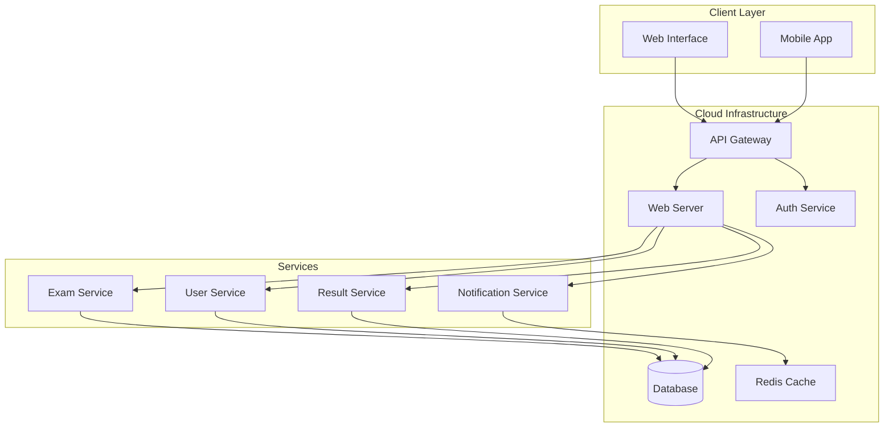
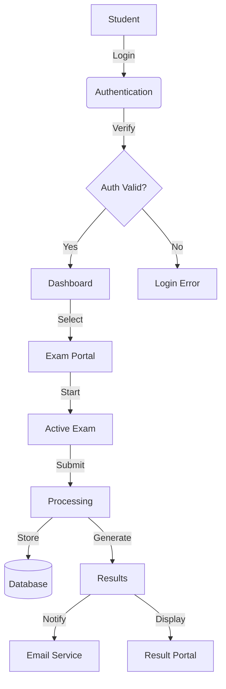
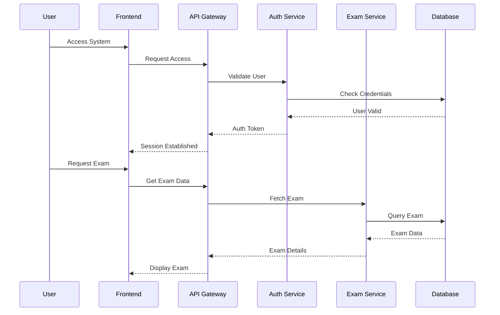
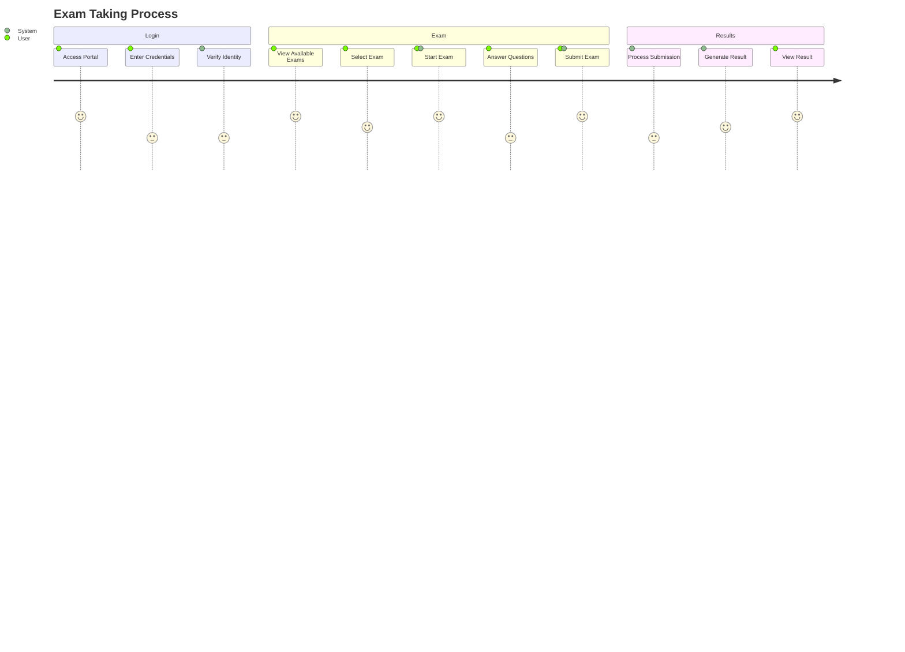
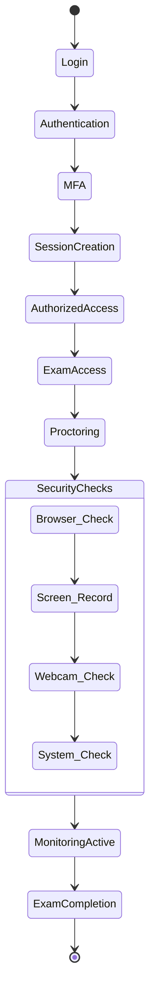
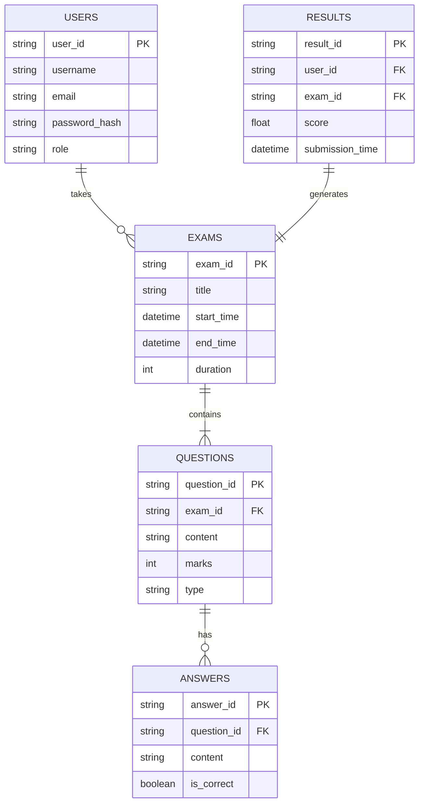

# 📊 Exam Central System Documentation

## 🏗 System Architecture Overview

## 🔄 Data Flow Diagram

## 🔄 Module Interaction Workflow

## 👤 User Journey Flows

## 🔒 Security Flow

## 📊 Database Relationships

