# 🎓 Exam Central System Documentation

## 📋 Table of Contents
1. [Project Overview](#project-overview)
2. [System Architecture](#system-architecture)
3. [Modules & Components](#modules-components)
4. [Technical Specifications](#technical-specifications)
5. [Implementation Details](#implementation-details)
6. [Development Guide](#development-guide)
7. [Security Implementation](#security-implementation)
8. [Deployment Strategy](#deployment-strategy)
9. [Testing Framework](#testing-framework)
10. [Mobile Integration](#mobile-integration)
11. [Advanced Features](#advanced-features)
12. [System Requirements & Setup](#system-requirements--setup)
13. [Troubleshooting Guide](#troubleshooting-guide)
14. [Performance Optimization](#performance-optimization)
15. [API Documentation](#api-documentation)
16. [Future Roadmap](#future-roadmap)
## 🎯 Project Overview

> [!NOTE]
> Exam Central is a centralized web application designed for Mumbai University to streamline examination-related activities.

### 🎊 Objective
To develop a comprehensive examination management system that ensures:
- ✨ Accuracy
- 🔄 Efficiency
- 🔍 Transparency

### 💫 Expected Impact
- 📉 Minimize manual errors
- 🤝 Enhance trust between stakeholders
- 📈 Improve scalability

## 🏗️ System Architecture

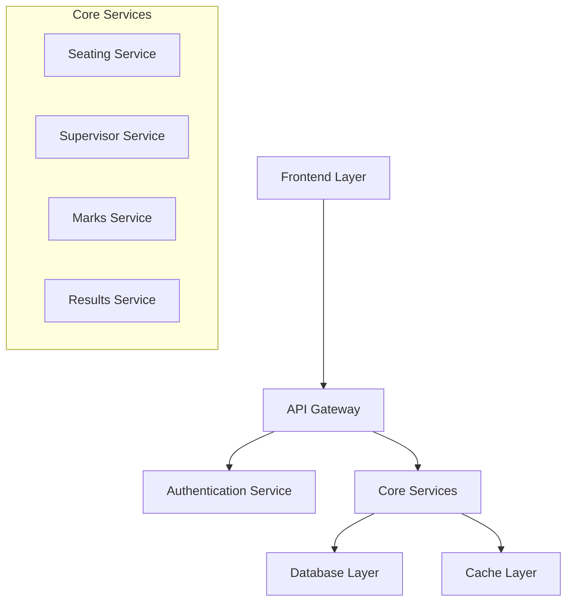

## 🧩 Modules & Components

### 1. 🎯 Seating Arrangement Module
- Auto-generation of seating plans
- Dynamic adjustments
- Visual layout management

### 2. 👥 Supervisor Assignment Module
- Automated assignments
- Workload balancing
- Notification system

### 3. 📊 Marks Calculation Module
- Assessment integration
- Secure mark entry
- Performance analytics

### 4. 📋 Results Management
- Secure result publishing
- Access control
- Report generation

### 5. 🎛️ Administrative Dashboard
- Real-time monitoring
- Trend analysis
- Policy compliance

### 6. 🤖 AI-Powered Features
- Automated proctoring
- Performance prediction
- Anomaly detection

## 🔧 Technical Specifications

### Database Schema
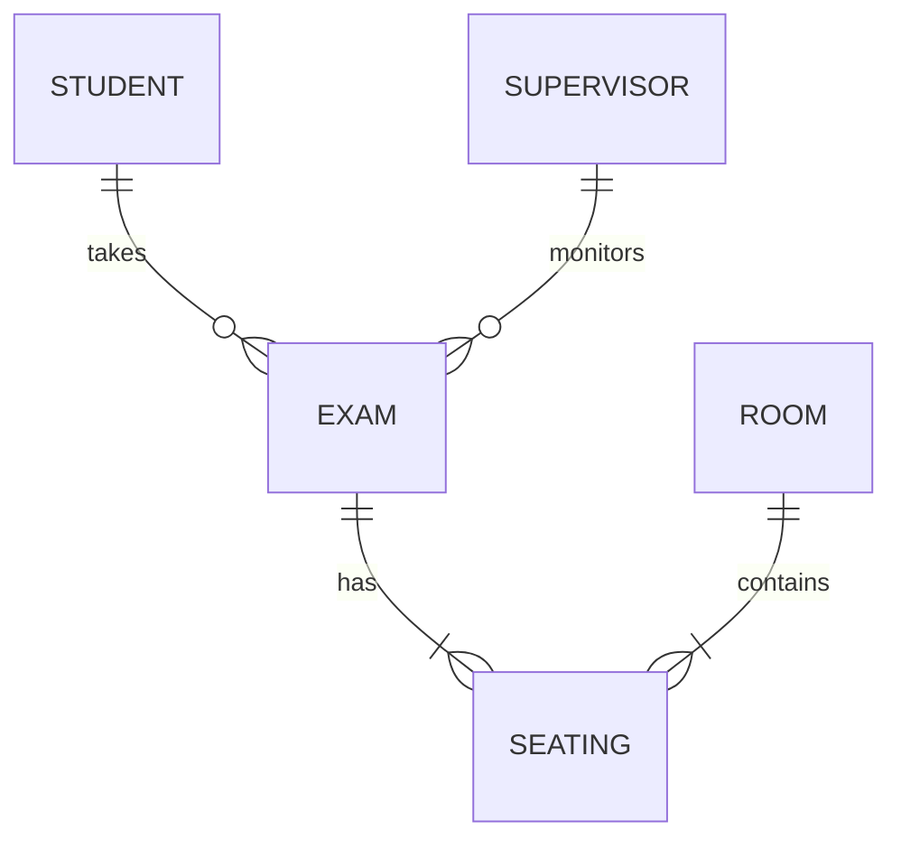

### API Structure
```yaml
/api/v1:
/students:
    - GET: List students
    - POST: Add student
/exams:
    - GET: List exams
    - POST: Create exam
/seating:
    - GET: Get arrangement
    - PUT: Update arrangement
```

## 🚀 Implementation Details

### Tech Stack
- 🖥️ Frontend: React.js
- ⚙️ Backend: Spring Boot
- 🗄️ Database: PostgreSQL
- 🔄 Cache: Redis
- 🔐 Auth: JWT + OAuth2

### Development Tools
- 🛠️ Git for version control
- 📦 Docker for containerization
- 🔄 Jenkins for CI/CD
- 📊 Grafana for monitoring

## 👨‍💻 Development Guide

### Setup Instructions
```bash
# Clone repository
git clone https://github.com/exam-central

# Install dependencies
npm install

# Run development server
npm run dev
```

> [!TIP]
> Always follow the coding standards and documentation guidelines

> [!IMPORTANT]
> Ensure security measures are implemented at every layer

> [!WARNING]
> Handle sensitive data according to data protection regulations


## 🔒 Security Implementation

### Authentication Flow
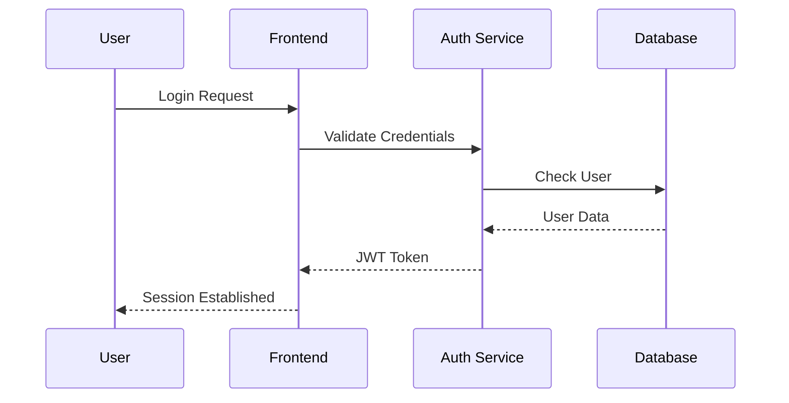

### 🔐 Data Security
- End-to-end encryption for sensitive data
- At-rest encryption using AES-256
- SSL/TLS for all network communication
- Regular security audits and penetration testing

### 👮 Access Control
- Role-based access control (RBAC)
- Multi-factor authentication
- IP whitelisting for admin access
- Session management and timeout

### 📝 Audit Logging
```yaml
log_format:
timestamp: ISO8601
user_id: string
action: string
resource: string
status: success|failure
ip_address: string
```

## 🚀 Deployment Strategy

### CI/CD Pipeline
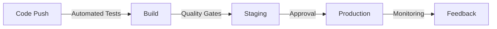

### 🌐 Environment Setup
- Development
- Testing
- Staging
- Production
- Disaster Recovery

### ⚖️ Scaling Strategy
- Horizontal scaling with Kubernetes
- Auto-scaling based on metrics
- Load balancing configuration
- Database sharding

## 🧪 Testing Framework

### Unit Testing
```javascript
describe('Marks Calculator', () => {
it('should calculate total marks correctly', () => {
    expect(calculateTotal([80, 75, 90])).toBe(245);
});
});
```

### Integration Testing
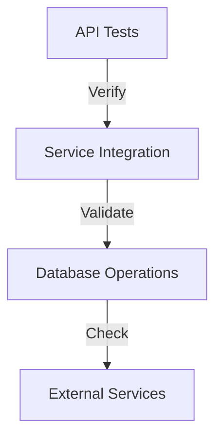

### Performance Testing Metrics
- Response time < 2s
- Concurrent users: 10,000
- Error rate < 0.1%
- Resource utilization < 80%

## 📱 Mobile Integration

### Native Features
- Biometric authentication
- Camera for document scanning
- Location services
- Local storage

### 🔄 Offline Capabilities
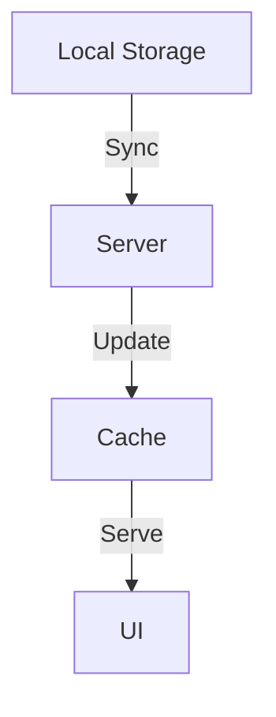

### 📲 Push Notifications
- Exam schedules
- Result announcements
- Important updates
- System notifications

## 🚀 Advanced Features

### 🤖 AI/ML Implementation
- Automated answer evaluation
- Plagiarism detection
- Performance prediction
- Pattern analysis

### 📊 Real-time Analytics
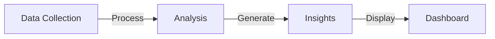

### ⛓️ Blockchain Integration
- Certificate verification
- Result immutability
- Credential management
- Digital signatures

## 🖥️ System Requirements & Setup

### 💻 Hardware Requirements
- CPU: 8+ cores for production
- RAM: 16GB minimum
- Storage: 500GB SSD
- Network: 1Gbps dedicated line

### 📚 Software Prerequisites
```yaml
required_software:
- Java JDK 17+
- Node.js 16+
- PostgreSQL 13+
- Redis 6+
- Docker 20+
- Kubernetes 1.21+
```

### 🌐 Network Requirements
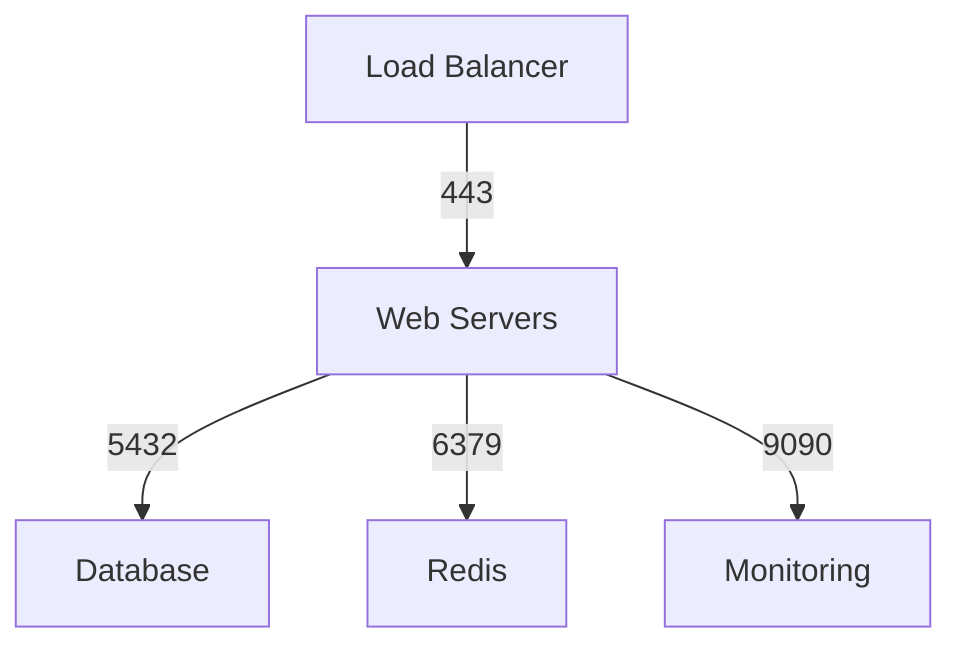

### 💾 Storage Considerations
- Document storage: 200GB
- Database storage: 100GB
- Backup storage: 300GB
- Log storage: 50GB

### ⚖️ Scaling Guidelines
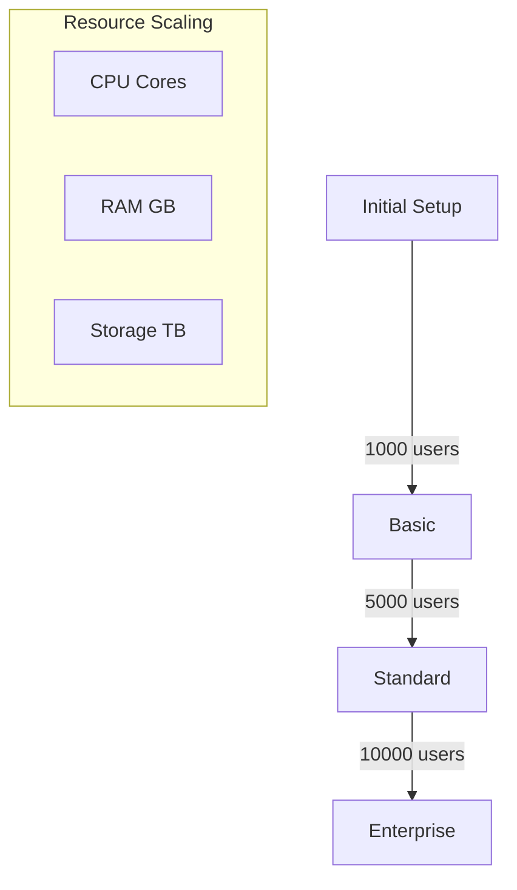

## 🔧 Troubleshooting Guide

### ⚠️ Common Issues
> [!WARNING]
> Monitor these key system indicators:
- High CPU usage (>80%)
- Memory leaks
- Slow response times
- Connection timeouts

### 🚨 Error Codes
```yaml
error_codes:
E1001: "Authentication Failed"
E1002: "Database Connection Error"
E1003: "Cache Miss"
E1004: "Rate Limit Exceeded"
E1005: "Invalid Input"
```

### 🔍 Debug Procedures
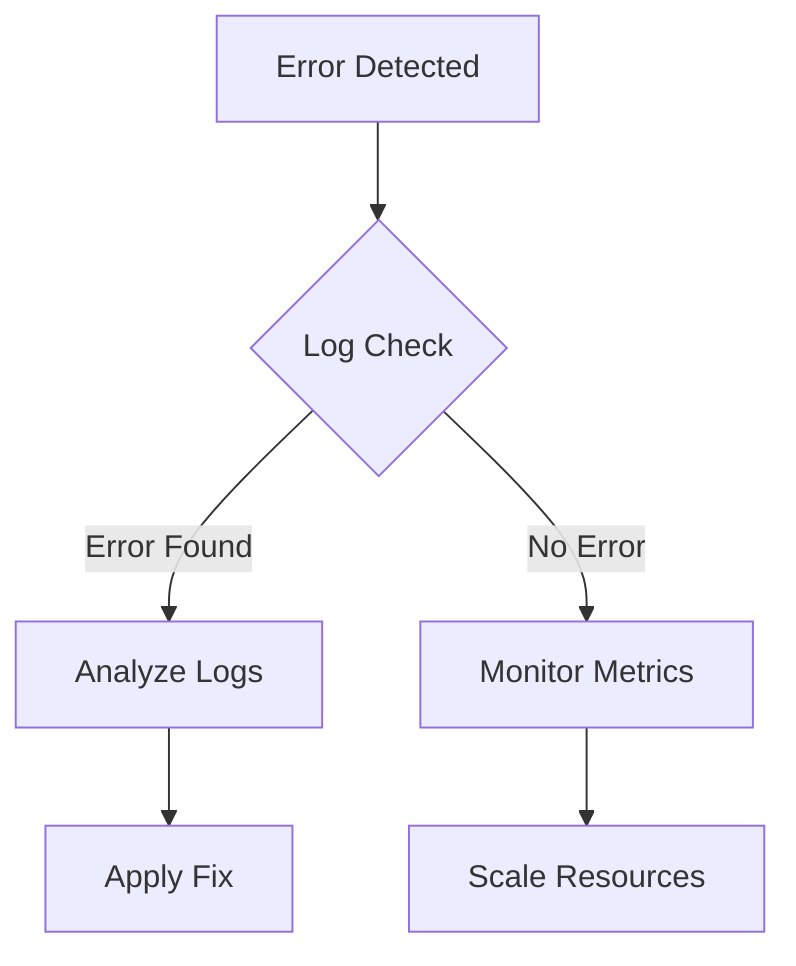

## ⚡ Performance Optimization

### 🔄 Caching Strategy
```yaml
cache_layers:
L1: "Application Cache (Memory)"
L2: "Redis Cache (Distributed)"
L3: "CDN Cache (Static Assets)"
```

### 🎯 Query Optimization
```sql
-- Example Optimized Query
SELECT s.id, s.name, COUNT(e.id) as exam_count
FROM students s
LEFT JOIN exams e ON s.id = e.student_id
WHERE e.date >= CURRENT_DATE - INTERVAL '30 days'
GROUP BY s.id, s.name
HAVING COUNT(e.id) > 0
```

### ⚖️ Load Balancing
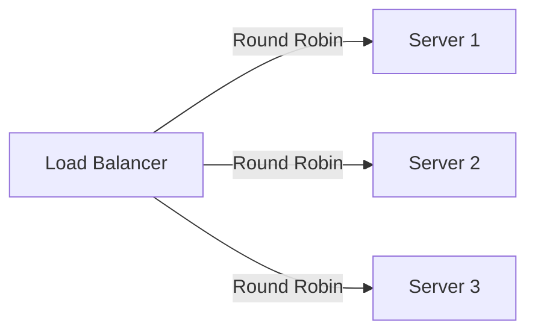

## 📚 API Documentation

### 🔐 Authentication
```javascript
// Authentication Example
const auth = async (req, res) => {
try {
    const token = await generateJWT(user);
    res.json({ token });
} catch (error) {
    res.status(401).json({ error: 'Auth failed' });
}
};
```

### 🚦 Rate Limiting
```yaml
rate_limits:
standard_user:
    requests: 100
    per: minute
premium_user:
    requests: 1000
    per: minute
```

## 🗺️ Future Roadmap

### 🎯 2024 Q1-Q2
- AI-powered exam analysis
- Blockchain certificates
- Mobile app enhancement
- Performance optimization

### 🎯 2024 Q3-Q4
- Real-time collaboration
- Advanced analytics
- Multi-institution support
- Cloud migration

### 🔮 2025 and Beyond
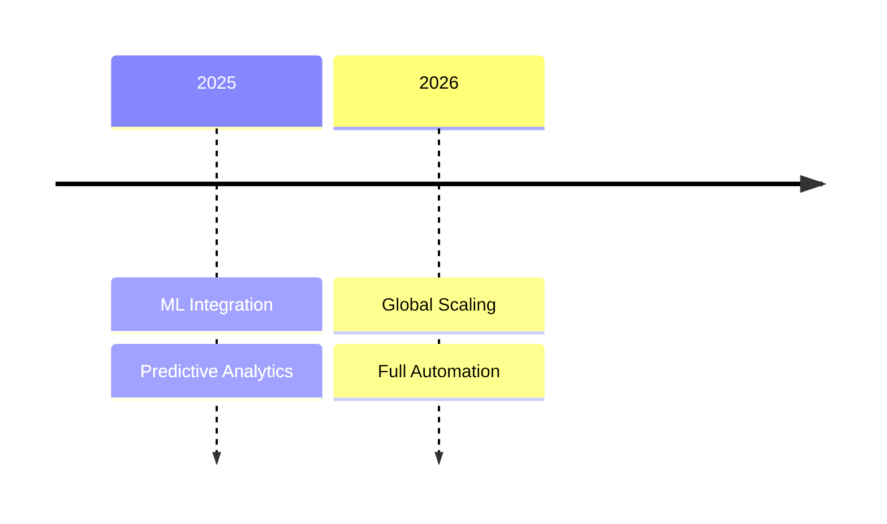

## 📚 Quick Start Guide

### 🚀 First-time Setup
```bash
# Clone repository
git clone https://github.com/exam-central/main

# Install dependencies
npm install

# Configure environment
cp .env.example .env

# Start development server
npm run dev
```

### ⚙️ Basic Configurations
```yaml
app_config:
environment: development
port: 3000
database_url: postgresql://localhost:5432/exam_central
redis_url: redis://localhost:6379
session_secret: your_secret_key
```

### 💡 Sample Implementation
```javascript
// Basic authentication setup
const setupAuth = async () => {
app.use(passport.initialize());
app.use(passport.session());

passport.use(new LocalStrategy(async (username, password, done) => {
    try {
    const user = await User.findOne({ username });
    if (!user) return done(null, false);
    const isValid = await user.validatePassword(password);
    return done(null, isValid ? user : false);
    } catch (error) {
    return done(error);
    }
}));
};
```

### 🎓 Quick Tutorials
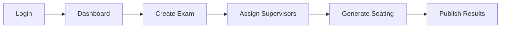

## 👥 User Guides & Tutorials

### 👑 Admin Guide
> [!NOTE]
> Essential administrative tasks and procedures

- System Configuration
- User Management
- Access Control
- Reporting Tools
- Audit Logs

### 👨‍💻 Developer Guide
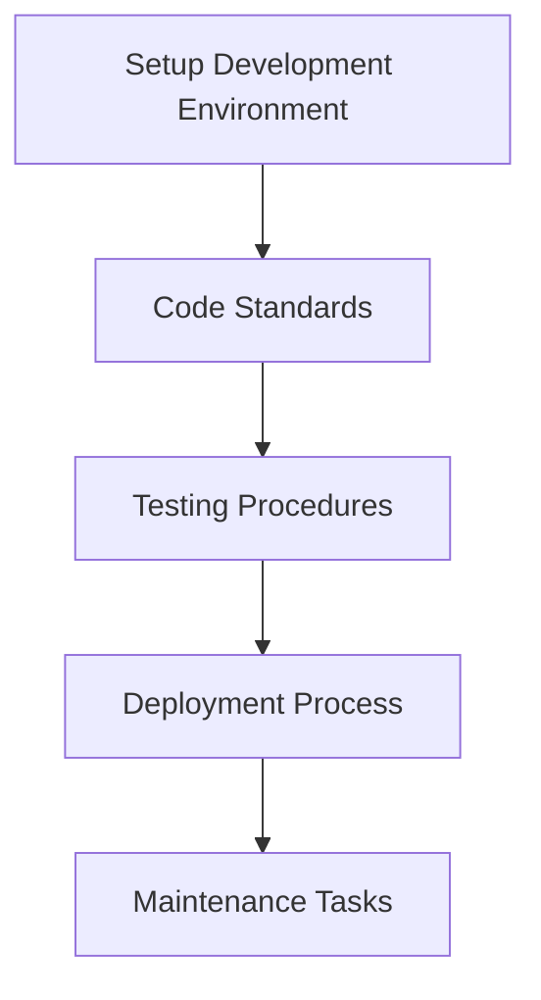

### 👤 End-user Guide
- Account Setup
- Basic Navigation
- Feature Usage
- Troubleshooting
- FAQ Access

## 🔗 Integration Examples

### 🌐 Third-party Integrations
```javascript
// Payment Gateway Integration
const setupPayment = async () => {
const stripe = require('stripe')(process.env.STRIPE_SECRET_KEY);

app.post('/payment', async (req, res) => {
    try {
    const session = await stripe.checkout.sessions.create({
        payment_method_types: ['card'],
        line_items: req.body.items,
        success_url: `${process.env.DOMAIN}/success`,
        cancel_url: `${process.env.DOMAIN}/cancel`,
    });
    res.json({ sessionId: session.id });
    } catch (error) {
    res.status(500).json({ error: error.message });
    }
});
};
```

### 🔐 Authentication Examples
```javascript
// OAuth2 Implementation
const setupOAuth = () => {
passport.use(new OAuth2Strategy({
    authorizationURL: 'https://provider.com/oauth2/authorize',
    tokenURL: 'https://provider.com/oauth2/token',
    clientID: OAUTH_CLIENT_ID,
    clientSecret: OAUTH_CLIENT_SECRET,
    callbackURL: "http://localhost:3000/auth/callback"
},
function(accessToken, refreshToken, profile, cb) {
    User.findOrCreate({ providerId: profile.id }, function (err, user) {
    return cb(err, user);
    });
}
));
};
```

## 🔄 Disaster Recovery & Backup

### 💾 Backup Procedures
```yaml
backup_schedule:
database:
    frequency: daily
    retention: 30 days
    type: incremental
files:
    frequency: hourly
    retention: 7 days
    type: differential
```

### 🔄 Recovery Plans
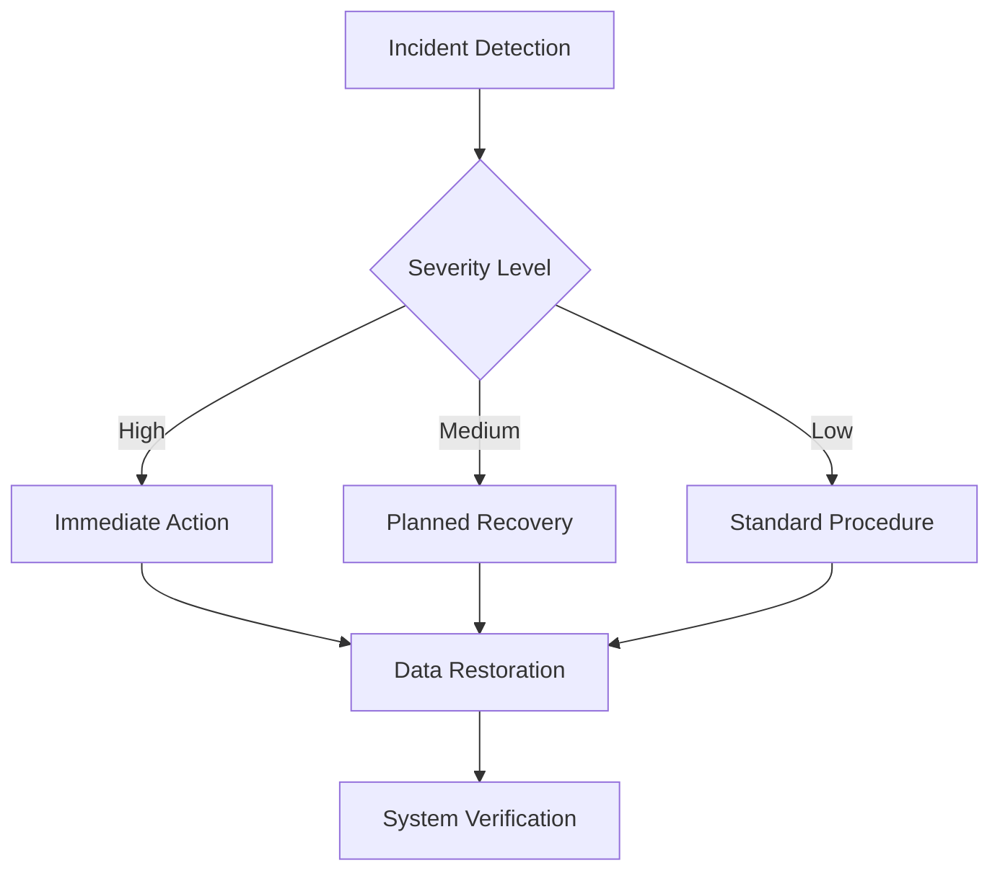

## ❓ FAQ & Troubleshooting

### 🤔 Common Questions
> [!TIP]
> Frequently asked questions and their solutions

1. System Access Issues
2. Performance Concerns
3. Data Management
4. Security Protocols
5. Integration Problems

### ⚠️ Known Issues
```yaml
known_issues:
authentication:
    - issue: "Session timeout too short"
    status: "Fixed in v2.1"
performance:
    - issue: "Slow response under heavy load"
    status: "Under investigation"
database:
    - issue: "Connection pool exhaustion"
    status: "Patched in v2.0.1"
```

## 📑 Appendices

### 📖 Glossary
```yaml
terms:
API: "Application Programming Interface"
JWT: "JSON Web Token"
RBAC: "Role-Based Access Control"
SSO: "Single Sign-On"
MFA: "Multi-Factor Authentication"
```

### 📝 Code Snippets
```javascript
// Utility Functions
const utils = {
validateInput: (input) => {
    // Input validation logic
    return typeof input === 'string' && input.length > 0;
},

formatResponse: (data) => {
    // Response formatting
    return {
    success: true,
    data,
    timestamp: new Date().toISOString()
    };
},

handleError: (error) => {
    // Error handling logic
    console.error(`Error: ${error.message}`);
    return {
    success: false,
    error: error.message,
    timestamp: new Date().toISOString()
    };
}
};
```

### 📋 Checklists
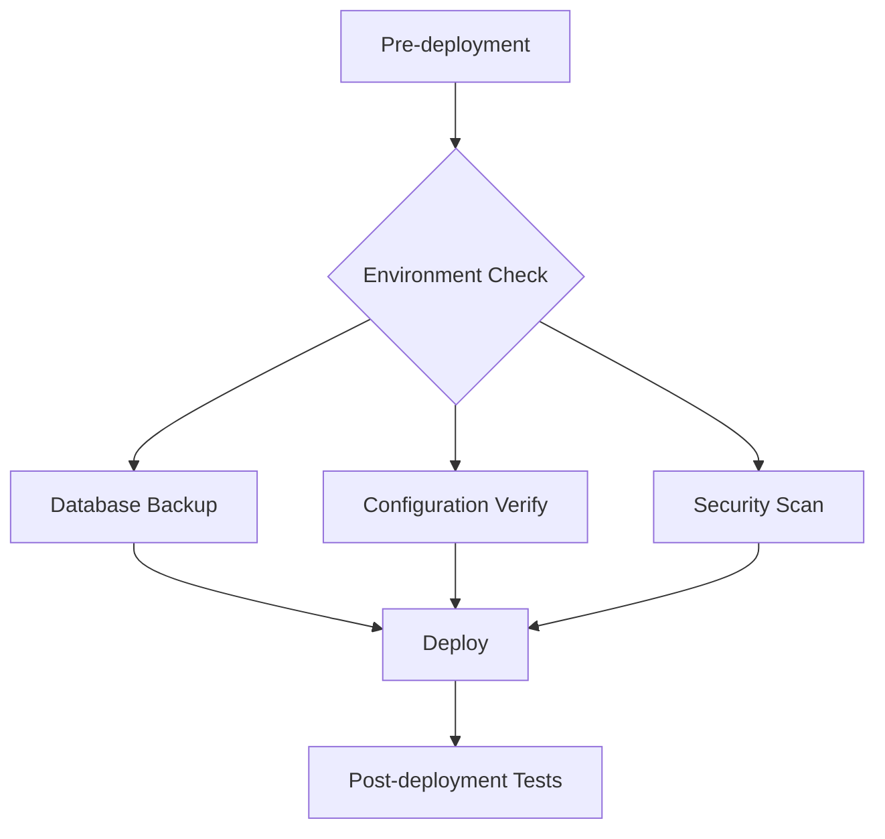
