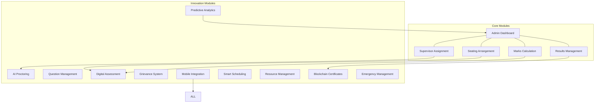
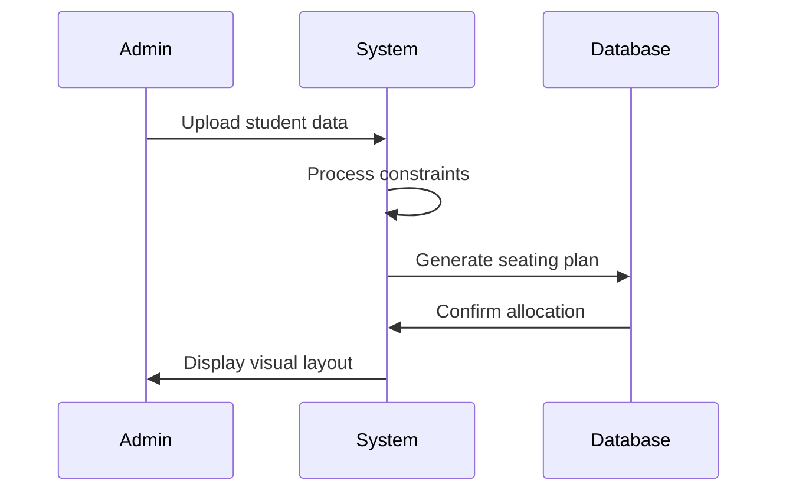
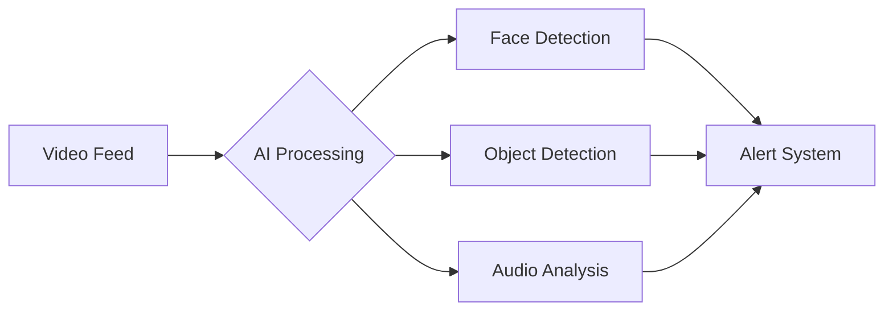
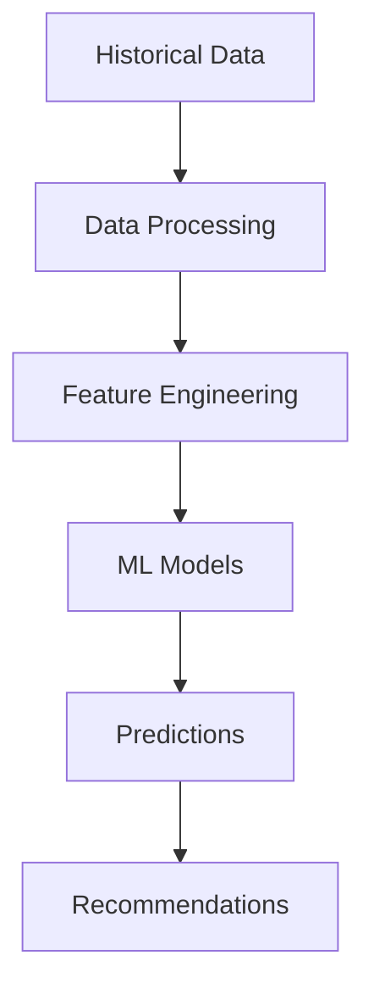
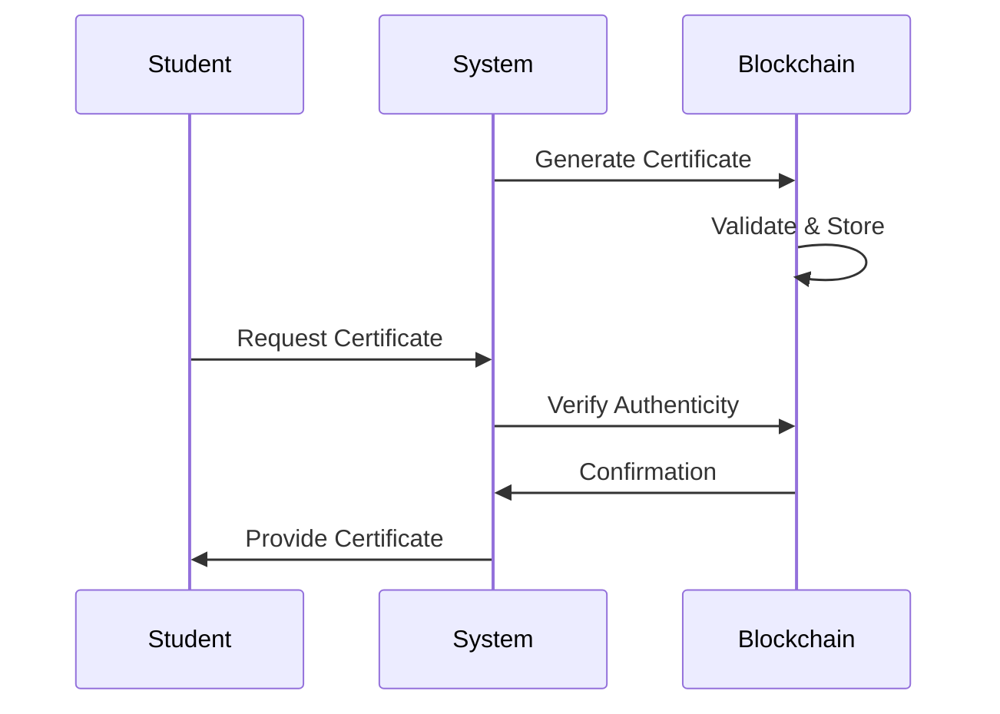
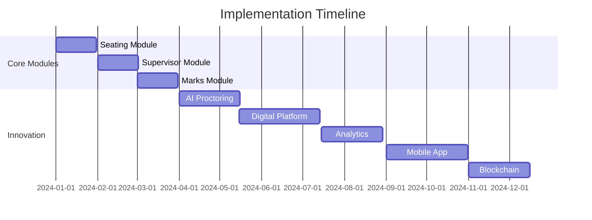
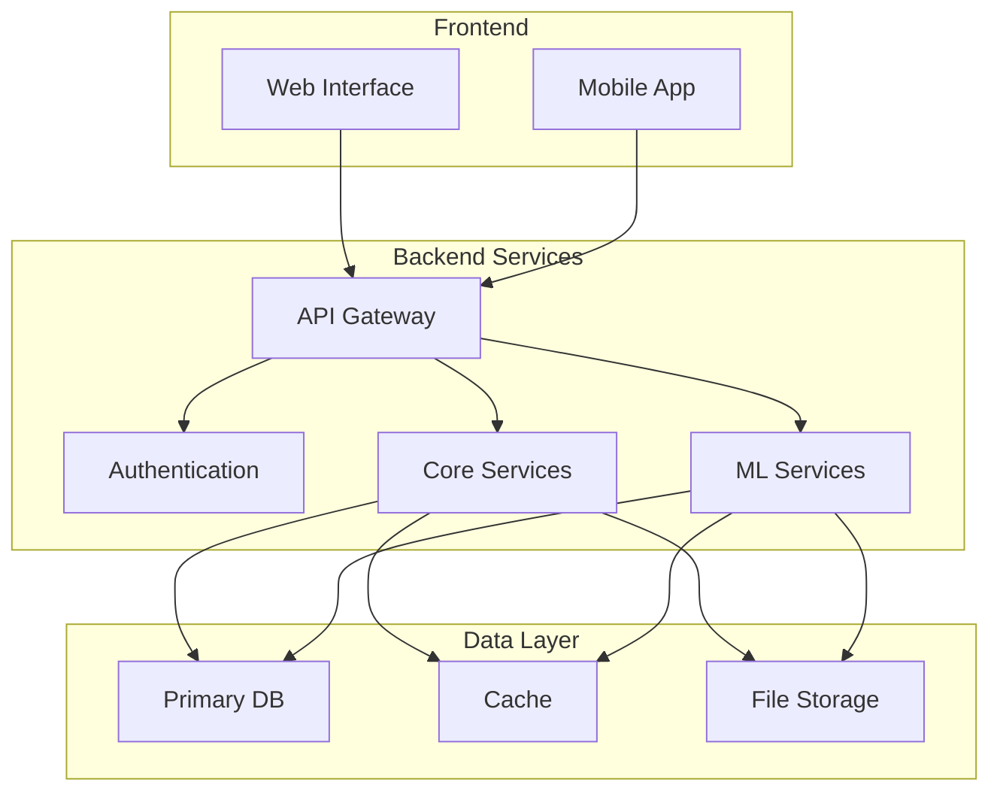

# Exam Central: Enhanced Examination Management System

## System Overview

## Core Modules

### 1. Seating Arrangement Module

#### Features
- Automated seat allocation based on multiple criteria
- Real-time adjustment capabilities
- Special accommodation handling
- Visual seating layout generator

#### Technical Requirements
- Graph-based allocation algorithm
- Real-time database (MongoDB/Redis)
- SVG layout generator
- RESTful API endpoints

### 2. Supervisor Assignment Module

#### Features
- Intelligent supervisor allocation
- Workload balancing
- Real-time notification system
- Conflict resolution

#### Technical Stack
- Node.js/Python backend
- WebSocket for real-time updates
- Push notification service
- Load balancing algorithm

### 3. Marks Calculation Module

#### Features
- Automated marks processing
- Multi-component assessment
- Grade calculation
- Performance analytics

#### Security Measures
- End-to-end encryption
- Role-based access control
- Audit logging
- Data versioning

## Innovation Modules

### 1. AI Proctoring System

#### Features
- Real-time face detection
- Behavior analysis
- Voice detection
- Screen monitoring
- Multiple device detection

### 2. Question Paper Management

#### Features
- Question bank management
- Automated paper generation
- Difficulty level analysis
- Version control
- Pattern matching

#### Technical Requirements
- ML-based question classification
- Secure storage system
- Pattern recognition algorithms
- PDF generation service

### 3. Digital Assessment Platform

#### Features
- Online examination interface
- Auto-grading system
- Plagiarism detection
- Real-time monitoring
- Performance analytics

### 4. Student Grievance System

#### Features
- Ticket management
- Automated routing
- Status tracking
- Resolution timeline
- Appeal management

### 5. Predictive Analytics

#### Features
- Performance prediction
- Resource optimization
- Risk assessment
- Trend analysis
- Recommendation engine

### 6. Mobile App Integration

#### Features
- Cross-platform support
- Offline capabilities
- Push notifications
- Biometric authentication
- Real-time updates

### 7. Smart Scheduling System

#### Features
- Conflict resolution
- Resource optimization
- Calendar integration
- Automated rescheduling
- Constraint satisfaction

### 8. Resource Management

#### Features
- Inventory tracking
- Resource allocation
- Utilization analytics
- Maintenance scheduling
- Cost optimization

### 9. Blockchain-based Certificate System

#### Features
- Tamper-proof certificates
- Digital signatures
- Verification portal
- Alumni tracking
- Integration with employers

### 10. Emergency Management System

#### Features
- Incident reporting
- Emergency protocols
- Communication system
- Backup procedures
- Recovery planning

## Implementation Roadmap

## Integration Matrix

| Module | Dependencies | Integration Points | Priority |
|--------|-------------|-------------------|----------|
| Seating | Database, UI | Schedule, Resources | High |
| Supervisor | Notification | Seating, Emergency | High |
| Marks | Security | Assessment, Analytics | High |
| AI Proctoring | ML Models | Assessment, Emergency | Medium |
| Mobile App | All Modules | User Interface | Medium |
| Blockchain | Certificates | Results, Verification | Low |

## Technical Architecture

