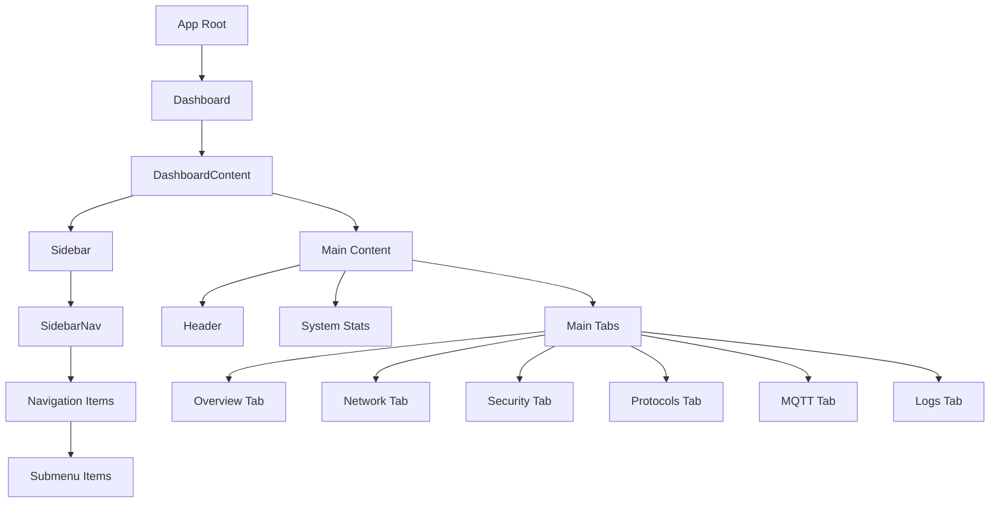
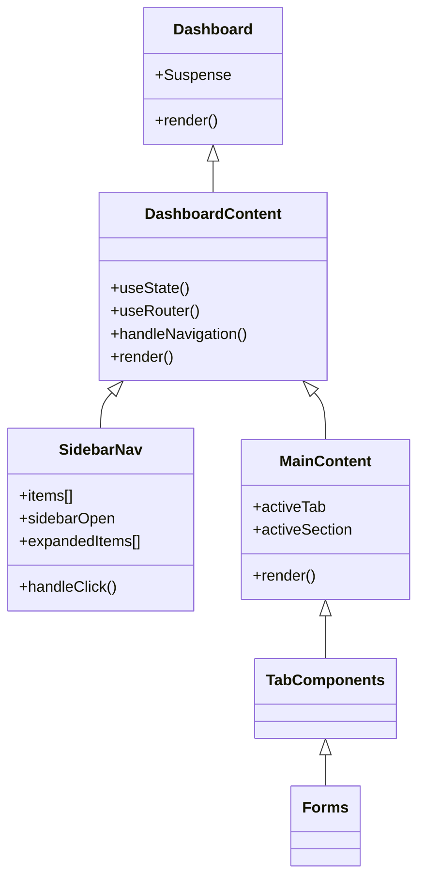
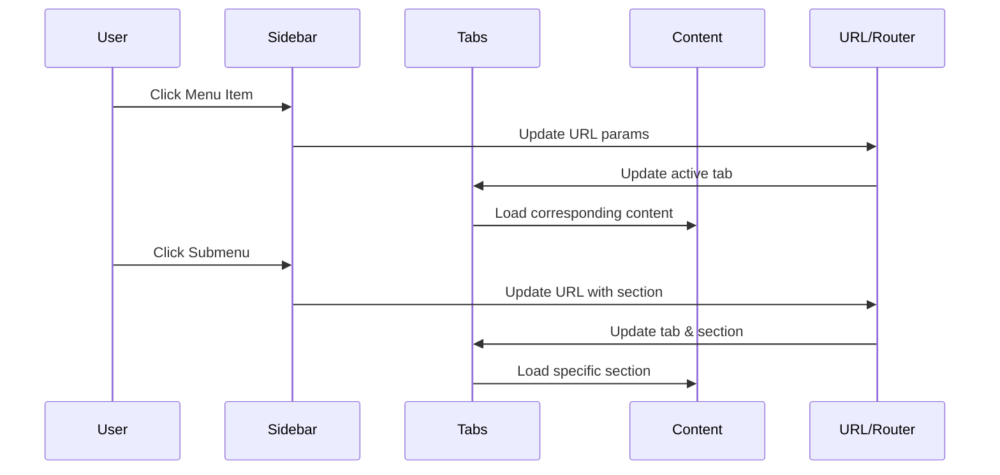
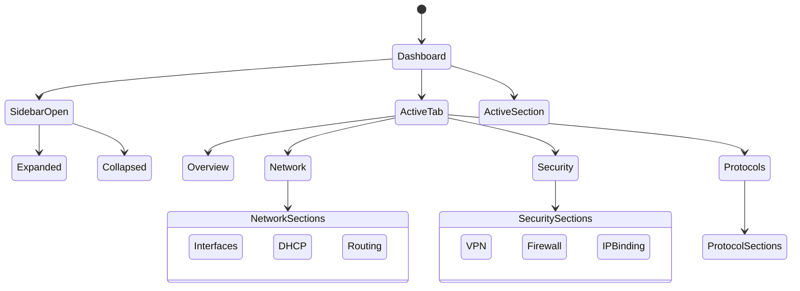

# IoT Gateway Management Dashboard

> [!info]
> A modern web application for managing industrial IoT gateways, built with Next.js, React, and Tailwind CSS.

![[https://images.unsplash.com/photo-1518770660439-4636190af475?q=80&w=1470&auto=format&fit=crop]]

## Application Architecture

> [!note]
> The following diagram illustrates the component hierarchy of the application.



## Component Structure

> [!tip]
> This class diagram shows the relationships between key components in the application.



## Navigation Flow

> [!tip]
> This sequence diagram illustrates how user interactions propagate through the application.



## State Management

> [!important]
> Understanding the state flow is critical for maintaining and extending the application.



## Component Details

### Core Components

> [!note]
> These components form the foundation of the application architecture.

1. **Dashboard** (`components/dashboard.tsx`)
   - Main container component
   - Handles layout and state management
   - Manages navigation and routing
   - Key features:
     - Collapsible sidebar
     - Tab-based navigation
     - URL-based state management

2. **SidebarNav** (`components/sidebar-nav.tsx`)
   - Collapsible sidebar navigation
   - Handles menu and submenu interactions
   - Manages navigation state
   - Features:
     - Expandable/collapsible sections
     - Active state indicators
     - Icon-only mode support

### Tab Components

> [!info]
> Each tab represents a major functional area of the application.

1. **NetworkTab** (`components/tabs/network-tab.tsx`)
   - Sections:
     - Interfaces
     - DHCP
     - Routing
     - Port Forwarding
     - Dynamic DNS
     - WiFi

2. **SecurityTab** (`components/tabs/security-tab.tsx`)
   - Sections:
     - IPSec VPN
     - Firewall
     - IP Binding
     - Encryption
     - Certificates

3. **ProtocolsTab** (`components/tabs/protocols-tab.tsx`)
   - Sections:
     - DNP3.0
     - OPC-UA
     - Modbus
     - IEC

### Form Components

> [!tip]
> Form components handle configuration input for various gateway settings.

Located in `components/forms/`:
- `ethernet-interface-form.tsx`
- `dhcp-server-form.tsx`
- `static-routes-form.tsx`
- `ipsec-vpn-form.tsx`
- `firewall-form.tsx`
- `mqtt-form.tsx`
- `dnp3-form.tsx`
- `opcua-form.tsx`
- `modbus-form.tsx`
- `iec-protocols-form.tsx`

### Dialog Components

> [!warning]
> Dialog components handle critical system operations and should be used with care.

Located in `components/dialogs/`:
- `restart-dialog.tsx`
- `export-config-dialog.tsx`
- `import-config-dialog.tsx`
- `reset-config-dialog.tsx`

## URL Structure

> [!example]
> The application uses URL parameters to maintain state and enable deep linking.

- Root: `/`
- With Tab: `/?tab=network`
- With Section: `/?tab=network&section=interfaces`
- Device Specific: `/?device=123&tab=network&section=interfaces`

## Key Features

1. **Responsive Layout**
   - Collapsible sidebar
   - Responsive grid layouts
   - Mobile-friendly design

2. **Navigation**
   - URL-based routing
   - Persistent state
   - Deep linking support

3. **Configuration**
   - Import/Export functionality
   - Reset to defaults option
   - Real-time validation
   - Auto-save support

4. **Security**
   - Role-based access control
   - Secure configuration handling
   - Audit logging
   - Session management

## Development

> [!example]
> Use these commands to set up and run the development environment.

```bash
# Install dependencies
pnpm install

# Run development server
pnpm dev

# Build for production
pnpm build

# Start production server
pnpm start
```

## Technology Stack

> [!important]
> The application is built using modern web technologies for optimal performance and developer experience.

- **Frontend Framework**
  - Next.js 14
  - React 18
  - TypeScript

- **Styling**
  - Tailwind CSS
  - Shadcn UI Components
  - Lucide Icons

- **State Management**
  - React Hooks
  - URL State
  - Local Storage

## Project Structure

> [!note]
> The codebase follows a clean, organized structure for maintainability.

```
├── app/
│   ├── page.tsx
│   ├── layout.tsx
│   └── loading.tsx
├── components/
│   ├── dashboard.tsx
│   ├── sidebar-nav.tsx
│   ├── tabs/
│   │   ├── network-tab.tsx
│   │   ├── security-tab.tsx
│   │   └── protocols-tab.tsx
│   ├── forms/
│   │   ├── ethernet-interface-form.tsx
│   │   ├── dhcp-server-form.tsx
│   │   └── ...
│   └── dialogs/
│       ├── restart-dialog.tsx
│       └── ...
└── lib/
    └── utils.ts
```

## Best Practices

> [!tip]
> Following these practices ensures a maintainable and scalable codebase.

1. **Component Organization**
   - Feature-based structure
   - Shared components
   - Clear naming conventions
   - Type safety

2. **State Management**
   - URL-based state
   - Local component state
   - Prop drilling minimization
   - Context when needed

3. **Performance**
   - Code splitting
   - Lazy loading
   - Optimized builds
   - Caching strategies

## Contributing

> [!important]
> We welcome contributions! Please follow these steps to contribute.

1. Fork the repository
2. Create your feature branch (`git checkout -b feature/AmazingFeature`)
3. Commit your changes (`git commit -m 'Add some AmazingFeature'`)
4. Push to the branch (`git push origin feature/AmazingFeature`)
5. Open a Pull Request

## License

> [!note]
> This project is licensed under the MIT License - see the LICENSE file for details.

