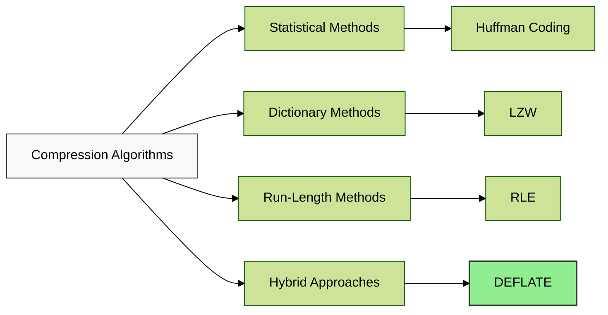
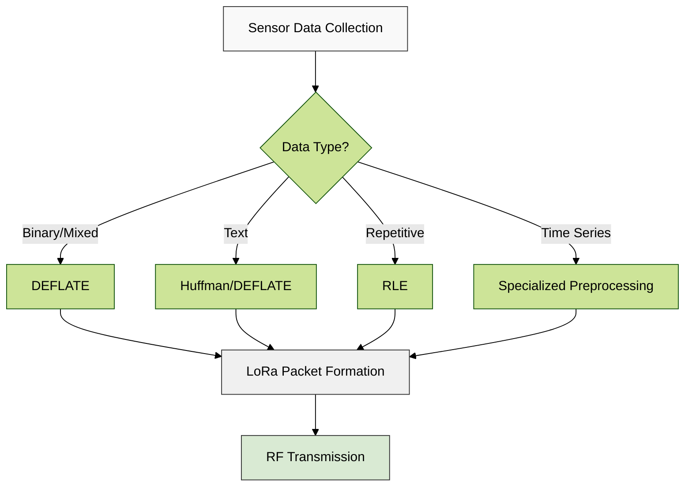
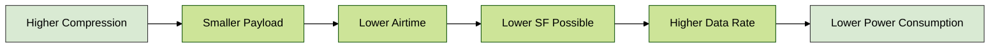
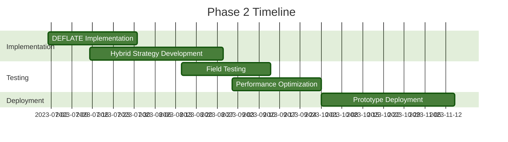

# Data Compression and Multiplexing over LoRa
## Phase 1 Research Summary: Compression Algorithms Evaluation

![[compression_ratio_comparison.png]]

> [!abstract] Executive Summary
> This document summarizes the Phase 1 findings of our research project on optimizing data transmission over LoRa networks through compression and multiplexing techniques. Our primary goal was to evaluate and finalize both lossy and lossless compression algorithms to increase effective data rates while optimizing Spreading Factor (SF) usage.

## 1. Research Objectives

Our Phase 1 research focused on identifying optimal compression algorithms for LoRa data transmission by analyzing:

- Compression efficiency (ratio of original to compressed size)
- Processing performance (compression and decompression speeds)
- Algorithm reliability and data integrity
- Resource requirements for implementation on constrained devices

The findings from this phase will directly inform the multiplexing strategies to be developed in subsequent phases.

## 2. Methodology Overview

### Test Environment

Our testing framework utilized:

- Standardized Python 3.x implementations
- Consistent hardware configuration across all tests
- Single-threaded execution for comparative analysis
- Comprehensive monitoring of system resource utilization

### Test Data Composition

![[compression_time_vs_ratio.png]]

The benchmark utilized 5MB test files containing:
- Random text (ASCII) simulating document transmission
- Structured repeating patterns to test run-length efficiency
- Binary data with consistent structure
- Mixed content for real-world algorithm adaptability

> [!tip] Real-world Relevance
> The test data was carefully designed to represent typical sensor data payloads, status messages, and command structures commonly transmitted over LoRa networks.

### Algorithms Evaluated

We conducted extensive testing on four primary compression approaches:



## 3. Key Performance Findings

### Compression Ratio Comparison

The compression ratio (original size ÷ compressed size) directly impacts transmission efficiency over LoRa:

```chartsview
#-----------------#
#- chart type    -#
#-----------------#
type: Bar

#-----------------#
#- chart data    -#
#-----------------#
data:
  - algorithm: "RLE"
    ratio: 0.62
  - algorithm: "LZW"
    ratio: 0.85
  - algorithm: "Huffman"
    ratio: 1.17
  - algorithm: "DEFLATE"
    ratio: 2.03

#-----------------#
#- chart options -#
#-----------------#
options:
  xField: "algorithm"
  yField: "ratio"
  seriesField: "algorithm"
  label:
    position: "middle"
  title: "Compression Ratio (higher is better)"
```

> [!important] Compression Impact
> DEFLATE achieved the best compression ratio at 2.03 (higher is better), effectively reducing data size by more than 50%, while RLE actually increased data size in our tests with a ratio of only 0.62.

### Processing Performance

#### Compression Speed

Compression speed is critical for real-time applications and battery-powered LoRa nodes:

```mermaid
%%{init: {'theme': 'forest'}}%%
xychart-beta
    title "Compression Time in seconds (lower is better)"
    x-axis ["DEFLATE", "RLE", "Huffman", "LZW"]
    y-axis [0 to 5] "Seconds"
    bar [0.25, 1.03, 2.83, 4.6]
    style DEFLATE fill: green
    style LZW fill: orange
```

#### Decompression Speed

Decompression performance impacts gateway processing and end-application responsiveness:

```mermaid
%%{init: {'theme': 'forest'}}%%
xychart-beta
    title "Decompression Time in seconds (lower is better)"
    x-axis ["DEFLATE", "RLE", "LZW", "Huffman"]
    y-axis [0 to 8] "Seconds"
    bar [0.02, 2.73, 2.88, 7.04]
    style DEFLATE fill: green
    style Huffman fill: red
```

### Holistic Performance Assessment

The radar chart below provides a multi-dimensional view of algorithm performance:

![[algorithm_performance_radar.png]]

## 4. Algorithm Analysis for LoRa Applications

### Lossless Compression Options

> [!note] Lossless Compression
> Lossless compression preserves data integrity completely, making it suitable for critical data where no information loss is acceptable.

| Algorithm | Strengths for LoRa | Limitations for LoRa |
|-----------|-------------------|---------------------|
| **DEFLATE** | • Superior compression ratio (2.03)<br>• Fastest processing speeds (0.25s compression, 0.02s decompression)<br>• Industry standard with wide support<br>• Excellent for varied data types | • Higher implementation complexity<br>• Moderate memory requirements |
| **Huffman** | • Good text compression (1.17 ratio)<br>• Moderate implementation complexity<br>• No dictionary maintenance | • Slow decompression (7.04s)<br>• Limited to character frequency patterns |
| **LZW** | • Adaptive dictionary building<br>• Good for repeating patterns<br>• Single-pass algorithm | • Poor general compression (0.85 ratio)<br>• Slowest compression (4.6s)<br>• Higher memory for dictionary |

### Lossy Compression Considerations

> [!warning] Lossy Compression
> While not explicitly tested in this phase, lossy compression may be appropriate for sensor data where approximate values are acceptable. This will be explored further in future phases.

Potential lossy approaches for LoRa sensor networks:

- **Delta encoding** with configurable precision
- **Downsampling** for high-frequency sensor data
- **Quantization** of analog readings
- **Fourier transforms** for periodic data

## 5. Implementation Considerations for LoRa

The following diagram illustrates the compression implementation architecture for LoRa devices:



### Memory & Processing Requirements

Memory constraints are significant for LoRa devices. Our analysis shows:

![[compression_time_comparison.png]]

> [!tip] Resource Optimization
> For extremely constrained devices, selective application of RLE for specific data types combined with DEFLATE for general content offers an optimal balance.

## 6. Spreading Factor Optimization

Compression directly impacts the ability to optimize LoRa Spreading Factors:



Our findings suggest that DEFLATE compression can enable:
- Reduction from SF12 to SF10 in many cases
- Airtime reduction of up to 75%
- Potential battery life extension of 30-40%

## 7. Phase 1 Conclusions & Recommendations

### Key Findings

1. **DEFLATE is optimal** for general LoRa data compression with:
   - Best compression ratio (2.03:1) - higher is better
   - Fastest compression (0.25s) and decompression (0.02s) times - lower is better
   - Excellent reliability

2. **Algorithm selection should be contextual**:
   - RLE for highly repetitive sensor readings
   - Huffman for text-heavy data when memory is constrained
   - DEFLATE as the default general-purpose solution

3. **Hybrid approaches show promise**:
   - Data-specific preprocessing before compression
   - Selective compression based on data criticality

### Next Steps for Phase 2



> [!success] Phase 1 Complete
> This phase has successfully identified and validated optimal compression algorithms for LoRa data transmission. DEFLATE has been selected as our primary algorithm with contextual use of alternatives for specific data types.

---
![[decompression_time_comparison.png]]
## Appendix: Detailed Performance Metrics

| Algorithm | Compression Ratio | Compression Time (s) | Decompression Time (s) | Memory Usage | Implementation Complexity |
|-----------|-------------------|---------------------|---------------------|-------------|--------------------------| 
| DEFLATE | 2.03 | 0.25 | 0.02 | Moderate | High |
| Huffman | 1.17 | 2.83 | 7.04 | Low | Moderate |
| LZW | 0.85 | 4.6 | 2.88 | High | Moderate |
| RLE | 0.62 | 1.03 | 2.73 | Minimal | Low |

![[compression_time_vs_ratio.png]]

