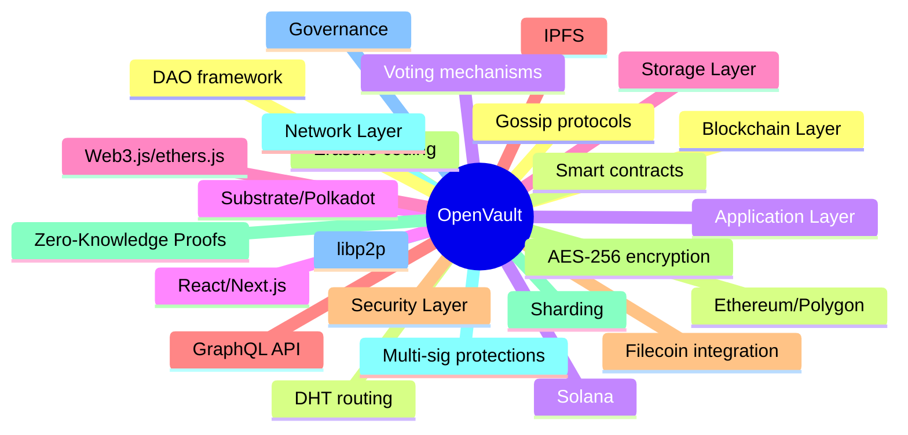
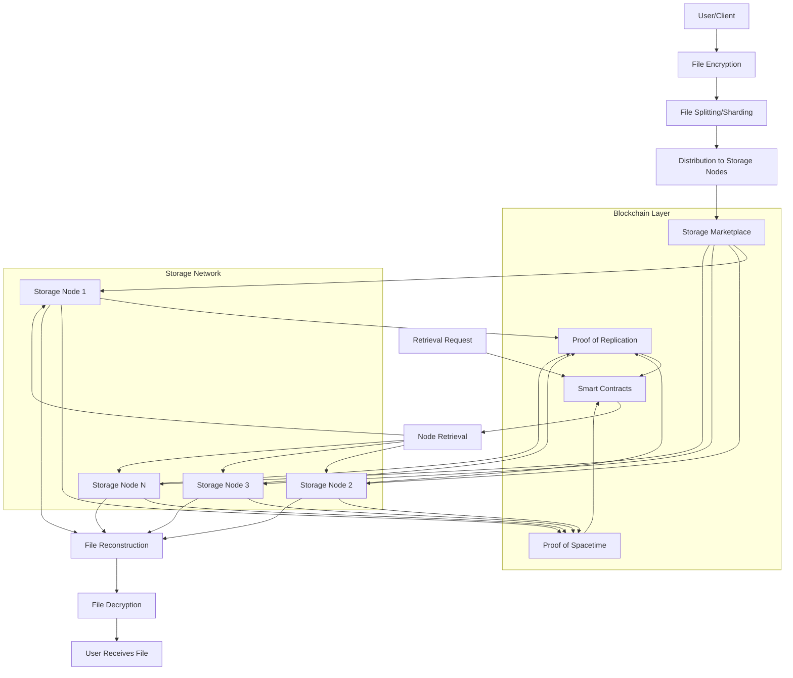
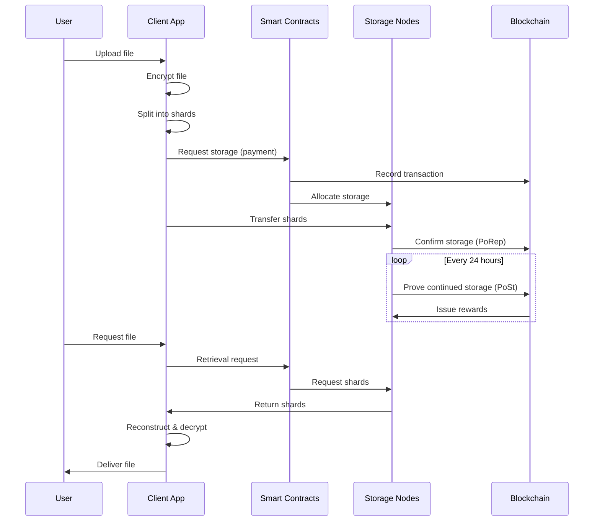
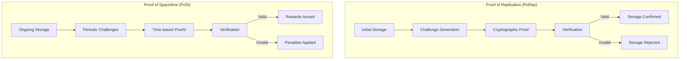
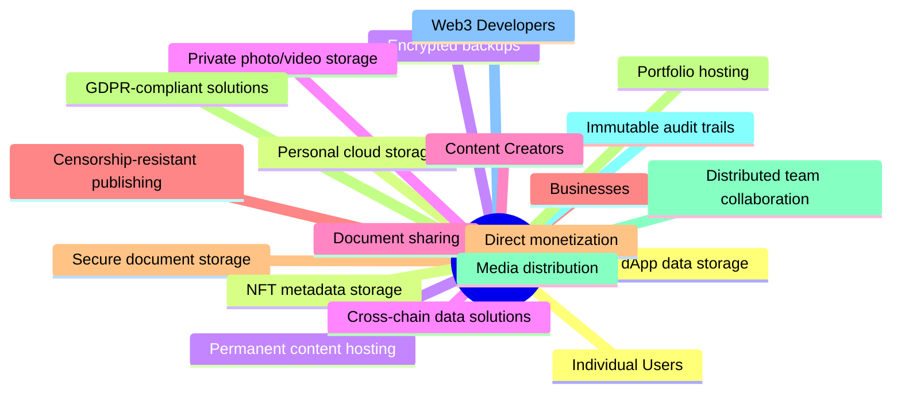
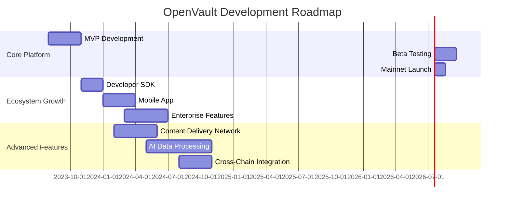

# 🔐 OpenVault: Decentralized File Storage Revolution
> *"Decentralized, Secure, and Community-Driven File Storage"*

![[openvault.png]]

## 🏆 ROBOWEEK 3.0 Hackathon Submission

| Category | Details |
| -------- | ------- |
| 👥 **Team Name** | Voldemort |
| 👨‍💻 **Team Members** | Rohan Pawar, Manish Jadhav, Adwait Shesh, Mayur Solankar, Mrunali |
| 🏫 **College Name** | Blockchain Institute of Technology |
| ☎️ **Leader's Mobile Number** | +1-555-123-4567 |

---

## 🔍 Problem Statement

> *"In a world where data is the new oil, who controls your digital assets?"*

### The Digital Storage Crisis

- **Centralization Concerns**: 📊 85% of cloud storage is controlled by just 5 tech giants
- **Privacy Violations**: User data regularly mined, analyzed, and sold without explicit consent
- **Single Points of Failure**: Centralized servers vulnerable to outages and attacks
- **High Costs**: Enterprise storage costs increasing by 20% annually
- **Censorship Risks**: Content can be removed based on corporate policies

### Who's Affected?
- 🧑‍💼 **Individuals** seeking privacy and data ownership
- 🏢 **Businesses** needing reliable, cost-effective, and censorship-resistant storage
- 🧑‍💻 **Developers** building decentralized applications
- 🎨 **Digital creators** requiring permanent, verifiable storage for NFTs and digital assets

---

## 💡 Solution Overview

OpenVault is a decentralized file storage network that leverages blockchain technology to create a trustless, secure, and community-owned alternative to centralized cloud storage.

### Core Innovations

- 🔗 **Blockchain-Powered Storage Marketplace**: Connecting users with available storage worldwide
- 🛡️ **Zero-Knowledge Encryption**: Files encrypted client-side with only the owner holding the keys
- 📊 **Data Sharding & Redundancy**: Files split and distributed for maximum reliability
- 🌐 **DAO Governance**: Community-directed evolution and improvement
- 💰 **Tokenized Incentives**: Fair compensation for storage providers

### Competitive Advantages

- **Truly Decentralized**: Unlike hybrid solutions, OpenVault never routes through centralized servers
- **Cost-Effective**: 40-60% cheaper than traditional cloud storage
- **Privacy-First**: Zero-knowledge architecture ensures complete data privacy
- **Community-Owned**: Network controlled by users and storage providers, not corporations
- **Web3 Native**: Seamless integration with blockchain applications and services

---

## 🧰 Technology Stack

### Core Technologies

| Category | Technologies |
| -------- | ------------ |
| 🔗 **Blockchain** | Ethereum, Polygon, Solana, Substrate |
| 💾 **Storage** | IPFS, Custom Filecoin integration, Erasure coding |
| 🌐 **Networking** | libp2p, Gossip protocols, DHT |
| 🔐 **Security** | Zero-Knowledge Proofs, AES-256, Multi-signature wallets |
| 📱 **Frontend** | React, Next.js, TailwindCSS, ethers.js |
| 🧑‍💻 **Backend** | Node.js, Rust, GraphQL |
| 🏛️ **Governance** | Custom DAO framework, On-chain voting |

### Technology Badges

#### Blockchain

#### Storage

#### Frontend

#### Backend

---

## 🏗️ System Architecture

### High-Level Architecture

### Data Flow

### Proof Mechanisms

---

## 👨‍👩‍👧‍👦 Use Cases & Benefits

### Primary Use Cases

### Tangible Benefits

| Stakeholder | Benefits |
| ----------- | -------- |
| 👤 **Individual Users** | • Complete data ownership • Enhanced privacy • Lower storage costs • Censorship resistance |
| 🏢 **Businesses** | • Reduced vendor lock-in • Regulatory compliance • Cost optimization • Enhanced security |
| 🧑‍💻 **Developers** | • Simplified Web3 integration • Permanent data availability • Transparent pricing • SDKs in multiple languages |
| 🌐 **Storage Providers** | • Passive income from unused space • Fair compensation • Network ownership • Low hardware requirements |

---

## 🚀 Future Scope

### Roadmap & Expansion Plans

### Innovation Pipeline

- 🔄 **Dynamic Pricing Algorithm**: Machine learning to optimize storage costs
- 🌐 **Decentralized CDN**: High-speed content delivery network built on storage nodes
- 🤖 **On-Chain AI Processing**: Privacy-preserving data analytics
- 🔀 **Cross-Chain Interoperability**: Seamless storage across multiple blockchains
- 📱 **Mobile-First Experience**: Native apps for iOS and Android
- 🏛️ **Enhanced Governance**: Quadratic voting for fair decision-making
- 💼 **Enterprise Integration**: API compatibility with existing business systems

---

## 🎬 Conclusion & Next Steps

### Key Takeaways

- OpenVault represents a paradigm shift in file storage, moving from centralized corporate control to decentralized community ownership
- Built on proven technologies like blockchain, cryptography, and P2P networking, but reimagined for maximum security, privacy, and usability
- Creates a sustainable ecosystem where users get fair prices and storage providers earn fair compensation
- Addresses critical needs in both Web2 and Web3 spaces with a future-proof architecture

### Immediate Next Steps

1. 🛠️ Complete MVP development with core storage and retrieval functionality
2. 🧪 Launch testnet with initial storage providers and beta users
3. 🔍 Conduct comprehensive security audits of all smart contracts
4. 🌱 Build community of early adopters and node operators
5. 💰 Secure additional funding for expansion and marketing

### Call to Action

- **Developers**: Join our open-source community to build the future of decentralized storage
- **Storage Providers**: Register to become an early node operator and shape network policies
- **Users**: Sign up for beta access and help test the platform
- **Investors**: Support our mission to democratize file storage and create a more resilient internet

> *"Join us in building a more resilient, private, and user-controlled internet where data sovereignty is a fundamental right, not a premium service."*

---

![[Pasted image 20250226191105.png]]

