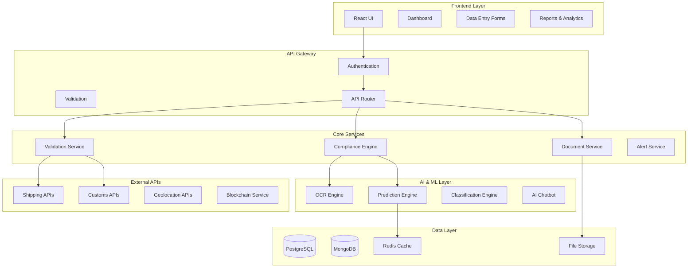
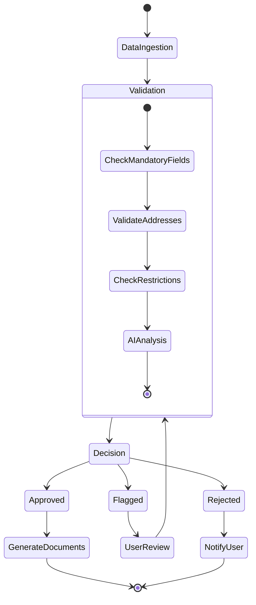
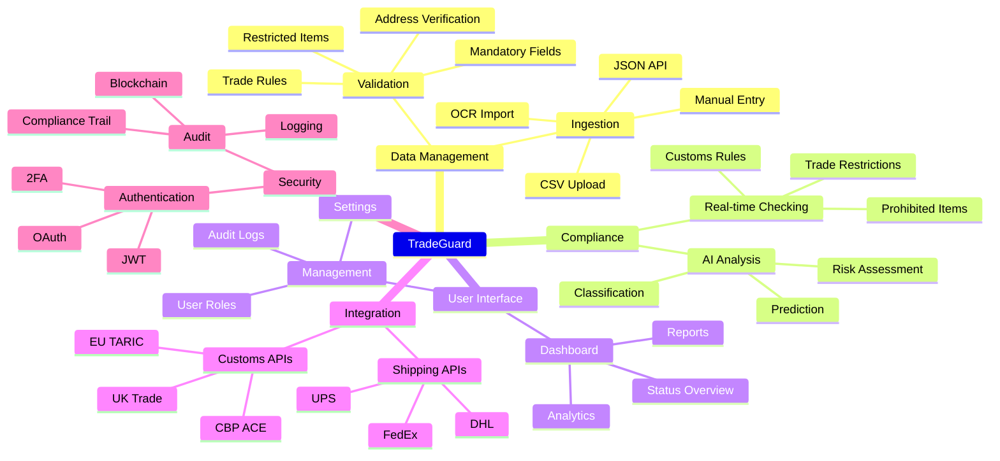
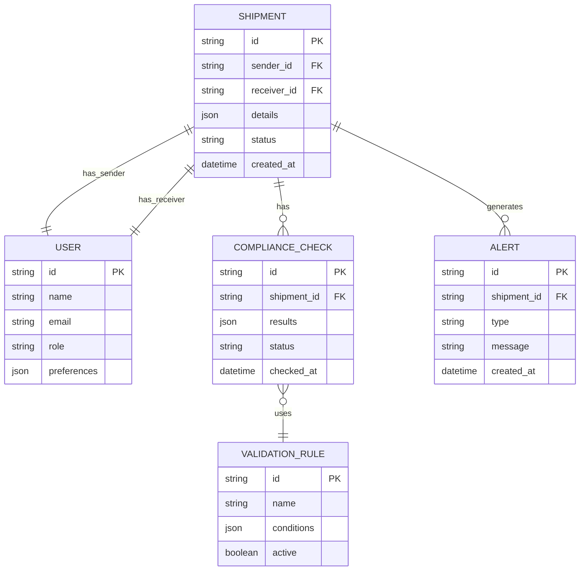
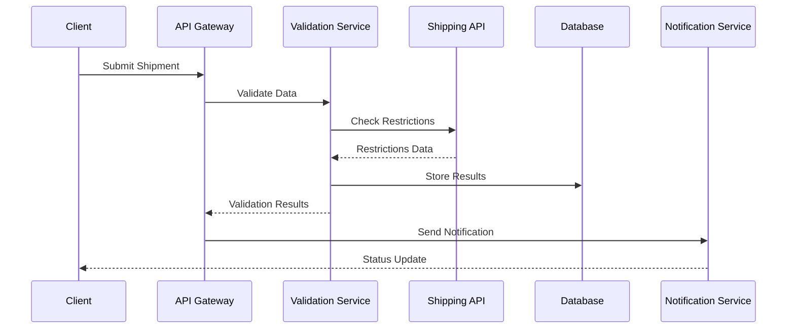

# TradeGuard - Cross-Border Shipment Compliance Platform

## Introduction
TradeGuard is a comprehensive compliance verification system for international shipments that helps businesses validate and ensure regulatory compliance before export. The system ingests parcel details, performs automated compliance checks, provides real-time validation, and generates necessary documentation.

## System Architecture

### Component Diagram

### Compliance Workflow

### Feature Mind Map

### Database Schema

### API Integration Flow

## Technical Implementation

### Tech Stack
- Frontend: React.js + Tailwind CSS
- Backend: Node.js + Express
- Database: PostgreSQL + MongoDB
- Cache: Redis
- ML/AI: TensorFlow, PyTorch
- APIs: REST/GraphQL
- DevOps: Docker, Kubernetes

### Key Features
1. Data Ingestion
- Multi-format support (CSV, JSON, XML)
- OCR document processing
- Manual data entry forms
- API integrations

2. Validation Engine
- Mandatory field checks
- Address verification 
- Restricted item validation
- Trade compliance rules
- Real-time validation

3. AI/ML Capabilities
- Document classification
- Risk assessment
- Compliance prediction
- Chatbot assistance

4. User Interface
- Modern React dashboard
- Real-time updates
- Interactive reports
- Document management
- User administration

5. Integration Points
- Shipping carriers (FedEx, DHL, UPS)
- Customs APIs (CBP ACE, EU TARIC)
- Address verification
- Payment processing
- Notification services

## Security Implementation

1. Authentication
- JWT based auth
- OAuth 2.0 support
- 2FA enablement
- Role-based access control

2. Data Protection
- End-to-end encryption
- Secure data storage
- Audit logging
- Access monitoring

3. Compliance Records
- Blockchain validation
- Immutable audit trails
- Digital signatures
- Version control

## Deployment Architecture

1. Container Orchestration
- Docker containerization
- Kubernetes clusters
- Auto-scaling
- Load balancing

2. Cloud Infrastructure
- Multi-cloud support
- Regional deployment
- High availability
- Disaster recovery

3. Monitoring & Maintenance
- Performance monitoring
- Error tracking
- Automated backups
- System updates

