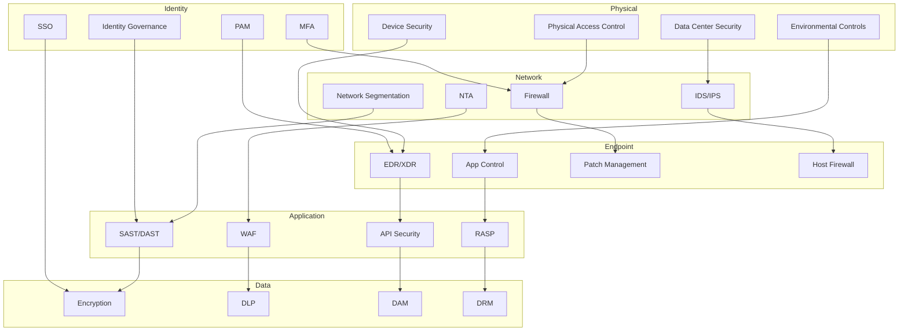
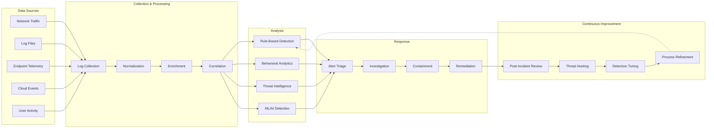
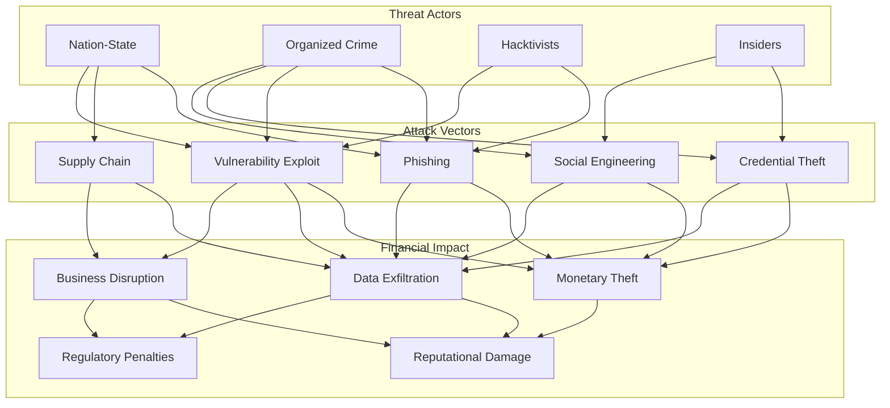
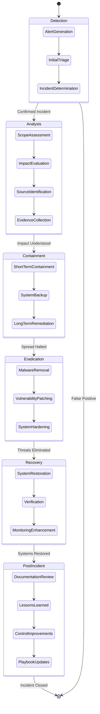

# ShieldFinance: Comprehensive Security Solution for Financial Institutions

> [!abstract] Executive Summary
> ShieldFinance is a comprehensive, cloud-integrated Security-as-a-Service (SecaaS) solution specifically designed to protect financial institutions against sophisticated cyber threats. This solution combines advanced threat detection, real-time monitoring, automated incident response, and regulatory compliance in a modular platform that scales with organizational needs. By leveraging cloud technologies while maintaining strict data sovereignty, ShieldFinance creates a defense-in-depth architecture that protects all aspects of a financial institution's digital ecosystem.

## Table of Contents

1. [Threat Landscape for Financial Institutions](#threat-landscape-for-financial-institutions)
2. [ShieldFinance Architecture Overview](#shieldfinance-architecture-overview)
3. [Core Security Components](#core-security-components)
4. [Cloud Security Integration](#cloud-security-integration)
5. [Financial Institution-Specific Protections](#financial-institution-specific-protections)
6. [Implementation Roadmap](#implementation-roadmap)
7. [Cost Analysis](#cost-analysis)
8. [Monetization as SecaaS](#monetization-as-secaas)
9. [Regulatory Compliance Framework](#regulatory-compliance-framework)
10. [Incident Response Playbooks](#incident-response-playbooks)
11. [Return on Security Investment](#return-on-security-investment)
12. [Appendices](#appendices)

## Threat Landscape for Financial Institutions

Financial institutions face an evolving threat landscape characterized by:

### External Threats
- **Advanced Persistent Threats (APTs)**: Sophisticated, targeted attacks by nation-states and organized criminal groups
- **Ransomware**: Increasingly targeted attacks focusing on financial data and infrastructure
- **DDoS Attacks**: High-volume attacks targeting online banking services and payment systems
- **Supply Chain Compromises**: Attacks targeting third-party service providers and software dependencies
- **Social Engineering**: Sophisticated phishing campaigns targeting employees and customers

### Internal Threats
- **Malicious Insiders**: Employees or contractors with access to sensitive systems and data
- **Accidental Data Exposure**: Unintentional disclosure of sensitive information
- **Privilege Misuse**: Abuse of authorized access for unauthorized purposes

### Financial Sector-Specific Threats
- **SWIFT Network Attacks**: Targeted compromises of financial messaging systems
- **ATM/POS Malware**: Specialized malware targeting ATM networks and point-of-sale systems
- **Credit Card Skimming**: Physical and digital skimming of payment card information
- **Account Takeover Fraud**: Sophisticated attacks to gain access to customer accounts
- **Real-time Payment Fraud**: Attacks targeting instant payment systems

> [!warning] Threat Evolution
> The threat landscape for financial institutions is evolving at an unprecedented pace, with attackers developing new techniques specifically targeting financial services infrastructure. Traditional security approaches are increasingly insufficient against these targeted threats.

## ShieldFinance Architecture Overview

ShieldFinance employs a defense-in-depth architecture with multiple security layers:

### Architecture Principles
- **Zero Trust Security Model**: "Never trust, always verify" approach to all network traffic and access requests
- **Defense in Depth**: Multiple layers of security controls throughout the IT infrastructure
- **Security by Design**: Security integrated into all aspects of IT infrastructure from design through implementation
- **Continuous Monitoring**: Real-time visibility into security events across the organization
- **Automated Response**: AI-driven response capabilities to detect and mitigate threats in real-time
- **Regulatory Alignment**: Controls mapped to financial sector regulatory requirements

### Key Technical Components
- **Security Operations Center (SOC)**: 24/7 monitoring and response capabilities
- **SIEM Platform**: Central collection and analysis of security events
- **Network Security Controls**: Next-generation firewalls, IDS/IPS, network traffic analysis
- **Endpoint Protection**: EDR/XDR solutions, application whitelisting, endpoint DLP
- **Identity and Access Management**: Privileged access management, MFA, identity governance
- **Data Protection**: Encryption, data loss prevention, database activity monitoring
- **Cloud Security**: CSPM, CWPP, CASB solutions for public, private, and hybrid cloud environments
- **Financial Services Controls**: Specialized security for payment systems, fraud detection, transaction monitoring

## Core Security Components

### Security Operations Center (SOC)

The SOC serves as the nerve center of the security program, providing 24/7 monitoring, detection, and response capabilities.

#### SOC Components:
- **SIEM Platform**: Advanced security information and event management solution that aggregates and correlates security data from across the organization
- **Threat Intelligence Platform**: Integration with financial sector-specific threat feeds and intelligence sources
- **Security Orchestration, Automation and Response (SOAR)**: Automated incident response workflows
- **Security Analytics**: AI and machine learning-based detection of anomalous behaviors and advanced threats
- **Vulnerability Management**: Continuous scanning and prioritization of security vulnerabilities

#### SOC Staffing Models (Tiered Options):
- **Tier 1**: Basic monitoring with 8x5 coverage (starting at $250K/year)
- **Tier 2**: Enhanced monitoring with 16x5 coverage (starting at $500K/year)
- **Tier 3**: Comprehensive monitoring with 24x7 coverage (starting at $1M/year)

### Network Security

#### Network Security Components:
- **Next-Generation Firewalls**: Advanced filtering capabilities including application awareness and user identity integration
- **DDoS Protection**: Cloud-based and on-premises DDoS mitigation to protect against volumetric and application-layer attacks
- **Web Application Firewalls**: Protection against OWASP Top 10 vulnerabilities and financial application-specific threats
- **Network Traffic Analysis**: Machine learning-based analysis of network traffic patterns to detect anomalies
- **Network Segmentation**: Micro-segmentation to isolate critical financial systems and limit lateral movement
- **Secure SD-WAN**: Software-defined wide area network for branch connectivity with integrated security controls
- **DNS Security**: Protection against DNS-based attacks and exfiltration techniques

### Endpoint Security

#### Endpoint Security Components:
- **Endpoint Detection and Response (EDR)**: Advanced protection, detection, and response capabilities for endpoints
- **Application Control**: Whitelisting to prevent execution of unauthorized applications
- **Endpoint Encryption**: Full disk and file-level encryption to protect sensitive data
- **Mobile Device Management**: Security controls for mobile devices accessing financial data
- **Endpoint DLP**: Data loss prevention controls at the endpoint level
- **Patch Management**: Automated vulnerability patching for operating systems and applications
- **Removable Media Controls**: Policies and technical controls for USB and other removable media

### Identity and Access Management

#### Identity and Access Management Components:
- **Identity Governance and Administration**: Automated user lifecycle management, access reviews, and segregation of duties
- **Multi-Factor Authentication**: Adaptive MFA with multiple authentication options including biometrics and hardware tokens
- **Privileged Access Management**: Just-in-time privileged access with session monitoring and recording
- **Customer Identity and Access Management**: Secure management of customer identities and access to financial services
- **Directory Services**: Centralized management of user identities and attributes
- **Role-Based Access Control**: Granular access policies based on job roles and responsibilities
- **Single Sign-On**: Secure authentication across multiple applications and services

### Data Security

#### Data Security Components:
- **Data Classification**: Automated identification and classification of sensitive financial data
- **Database Activity Monitoring**: Real-time monitoring of database access and activity
- **Data Loss Prevention**: Content-aware policies to prevent unauthorized disclosure of sensitive information
- **Encryption**: Data encryption at rest, in transit, and in use with financial-grade encryption standards
- **Tokenization**: Replacement of sensitive data with non-sensitive tokens
- **Digital Rights Management**: Protection of sensitive documents and intellectual property
- **Secure Data Sharing**: Secure channels for sharing sensitive financial information with third parties

## Cloud Security Integration

ShieldFinance provides comprehensive security for hybrid and multi-cloud environments commonly used by financial institutions.

### Cloud Security Framework
- **Multi-Cloud Security Strategy**: Consistent security controls across AWS, Azure, Google Cloud, and private cloud environments
- **Cloud Security Posture Management (CSPM)**: Continuous monitoring and remediation of cloud misconfigurations and compliance violations
- **Cloud Workload Protection Platforms (CWPP)**: Security for cloud-native applications, containers, and serverless functions
- **Cloud Access Security Brokers (CASB)**: Visibility and control over SaaS applications used by financial institutions
- **Data Sovereignty Controls**: Geographical restrictions on data storage and processing to comply with regulatory requirements
- **DevSecOps Integration**: Security controls integrated into CI/CD pipelines for cloud-native development
- **Cloud Security Automation**: Automated remediation of security issues and policy violations

### Financial Services Cloud Security Considerations
- **Regulatory Compliance**: Cloud environments configured to meet financial regulations (e.g., PCI DSS, GDPR, local banking regulations)
- **Shared Responsibility Model**: Clear delineation of security responsibilities between the financial institution and cloud providers
- **Data Residency**: Controls to ensure sensitive financial data remains within approved jurisdictions
- **Cloud Encryption**: Customer-managed encryption keys for all sensitive financial data in the cloud
- **Third-Party Risk Management**: Assessment and continuous monitoring of cloud service provider security posture
- **Recovery and Resilience**: Cross-region failover and disaster recovery capabilities

### Cloud Security Pricing Tiers
- **Basic Tier**: CSPM with compliance reporting ($100K/year)
- **Standard Tier**: CSPM, CWPP, and CASB for primary cloud provider ($250K/year)
- **Premium Tier**: Comprehensive multi-cloud security with advanced automation ($500K/year)

## Financial Institution-Specific Protections

ShieldFinance includes specialized security controls designed specifically for the unique needs of financial institutions:

### Retail Banking Security
- **Online Banking Protection**: Advanced security for digital banking platforms
- **Mobile Banking Security**: Secure SDK and runtime application self-protection for mobile banking apps
- **ATM Network Security**: Protection against logical and physical attacks on ATM infrastructure
- **Payment Card Security**: End-to-end encryption and tokenization for payment card data
- **Branch Security**: Physical security integration with cybersecurity monitoring
- **Customer Fraud Prevention**: Behavioral analytics to detect and prevent account takeover and fraudulent transactions

### Investment Banking and Capital Markets
- **Trading Platform Security**: Low-latency security controls for high-frequency trading systems
- **Market Data Protection**: Secure access to market data feeds and analytics
- **Deal Information Security**: Data leak prevention for sensitive M&A and deal information
- **Communications Monitoring**: Surveillance of electronic communications for compliance and security
- **Algorithm Protection**: Security for proprietary trading algorithms and strategies

### Insurance Sector Security
- **Claims Processing Security**: Fraud detection for insurance claims
- **Policy Management Security**: Protection of policy holder information
- **Underwriting Systems Security**: Security for automated underwriting systems
- **Actuarial Data Protection**: Controls for sensitive actuarial calculations and data
- **Reinsurance Information Security**: Secure sharing of information with reinsurers

### Asset and Wealth Management
- **Portfolio Management System Security**: Protection for investment management platforms
- **Client Data Protection**: Enhanced security for high-net-worth individual information
- **Investment Advisor Security**: Secure mobility and access for financial advisors
- **Alternative Investment Security**: Specialized controls for private equity and hedge fund operations
- **Trust and Estate Planning Security**: Protection of sensitive estate planning documents

### Payment Processing
- **Card Processing Security**: PCI DSS compliant security for card processing systems
- **Real-time Payment Security**: Fraud detection for instant payment systems
- **Cross-border Payment Security**: Enhanced controls for international payments
- **Digital Wallet Security**: Protection for mobile payment applications
- **Payment Gateway Security**: API security for payment gateway integrations
- **Merchant Acquiring Security**: Monitoring of merchant payment processing for fraud

### Core Banking Systems
- **Core Banking Platform Security**: Protection for central banking platforms
- **General Ledger Security**: Controls for financial accounting systems
- **Customer Information System Security**: Protection of central customer databases
- **Loan Management System Security**: Security for lending platforms
- **Interbank System Security**: Protection for connections to central banks and other financial institutions

## Implementation Roadmap

ShieldFinance can be implemented in phases to manage complexity and prioritize the most critical security controls:

### Phase 1: Foundation (Months 1-3)
- Initial security assessment and gap analysis
- Implementation of core security infrastructure (SIEM, EDR, IAM)
- Deployment of critical network security controls
- Establishment of security baseline and policies
- Development of incident response procedures
- Quick-win vulnerability remediation

#### Phase 1 Deliverables:
- Security assessment report
- Core security architecture design
- Security policy framework
- Initial security monitoring capabilities
- Incident response playbooks
- Executive dashboard and reporting

#### Phase 1 Cost: $1.2M - $1.8M

### Phase 2: Enhancement (Months 4-6)
- Expansion of security monitoring capabilities
- Implementation of advanced network security controls
- Deployment of cloud security framework
- Enhanced identity and access management controls
- Integration of threat intelligence feeds
- Implementation of data security controls
- Security awareness training program launch

#### Phase 2 Deliverables:
- Enhanced detection and response capabilities
- Cloud security architecture
- Privileged access management solution
- Data classification and protection framework
- Threat intelligence integration
- Initial compliance reporting
- Security awareness program

#### Phase 2 Cost: $1.5M - $2.2M

### Phase 3: Maturity (Months 7-12)
- Advanced analytics and user behavior analysis
- Automated security orchestration and response
- DevSecOps integration for secure application development
- Expansion of financial services-specific controls
- Integration with third-party risk management
- Comprehensive regulatory compliance mapping
- Red team exercises and advanced testing

#### Phase 3 Deliverables:
- Security automation workflows
- DevSecOps pipeline and tools
- Financial services security controls
- Third-party risk management framework
- Comprehensive compliance reporting
- Penetration testing and red team reports
- Mature security metrics and KPIs

#### Phase 3 Cost: $2.0M - $3.0M

### Phase 4: Optimization (Months 13-18)
- Advanced threat hunting capabilities
- Security program optimization based on metrics
- Integration of artificial intelligence for threat detection
- Advanced deception technology deployment
- Continuous improvement program
- Security program benchmarking
- Supply chain security enhancement

#### Phase 4 Deliverables:
- Threat hunting playbooks
- AI-based detection models
- Deception network deployment
- Security program maturity assessment
- Supply chain security framework
- Long-term security roadmap

#### Phase 4 Cost: $1.8M - $2.5M

### Total Implementation Cost (18 months): $6.5M - $9.5M

## Cost Analysis

ShieldFinance's modular approach allows financial institutions to scale security investments based on their size, complexity, and risk profile.

### Initial Setup Costs

| Component | Description | Cost Range |
|-----------|-------------|------------|
| Security Assessment | Comprehensive assessment of current security posture | $150K - $300K |
| Architecture Design | Development of security architecture and roadmap | $200K - $400K |
| Core Infrastructure | SIEM, EDR, network security, IAM foundation | $1.5M - $3M |
| Cloud Security | CSPM, CWPP, CASB implementation | $500K - $1M |
| Security Integration | Integration with existing security tools and systems | $300K - $600K |
| Data Protection | Data security controls implementation | $400K - $800K |
| Initial Training | Staff training and knowledge transfer | $150K - $300K |
| **Total Initial Setup** |  | **$3.2M - $6.4M** |

### Annual Operational Costs

| Component | Description | Cost Range |
|-----------|-------------|------------|
| SOC Operations | 24/7 security monitoring and incident response | $1M - $2.5M |
| Managed Security Services | Managed detection and response services | $800K - $1.6M |
| Tool Licensing | Annual licensing for security technologies | $1.2M - $2.5M |
| Threat Intelligence | Premium threat feed subscriptions | $250K - $500K |
| Staff Augmentation | Specialized security expertise | $600K - $1.2M |
| Compliance Management | Ongoing compliance activities and reporting | $300K - $600K |
| Security Testing | Penetration testing, red team exercises | $400K - $800K |
| Training and Awareness | Ongoing security awareness program | $200K - $400K |
| **Total Annual Operations** |  | **$4.75M - $10.1M** |

### Cost Scaling Factors

The total cost of the ShieldFinance solution will vary based on several organizational factors:

- **Organization Size**: Number of employees, customers, and digital assets
- **IT Infrastructure Complexity**: Number of applications, cloud environments, and data centers
- **Regulatory Requirements**: Specific compliance mandates based on jurisdiction and services offered
- **Threat Profile**: Specific threats targeted at the financial institution
- **Security Maturity**: Current security capabilities and gaps
- **Geographic Distribution**: Number of locations and international presence
- **Digital Transformation Pace**: Rate of technology change within the organization

### Cost Optimization Strategies

ShieldFinance includes several approaches to optimize security spending:

- **Risk-Based Implementation**: Prioritizing controls based on risk assessment
- **Technology Consolidation**: Reducing tool sprawl and overlapping capabilities
- **Automation Focus**: Reducing operational costs through security automation
- **Cloud-Based Delivery**: Leveraging cloud economies of scale
- **Shared Security Services**: Centralized security services across business units
- **Strategic Outsourcing**: Leveraging managed security services for specialized functions
- **Open-Source Integration**: Incorporating open-source security tools where appropriate

## Monetization as SecaaS

ShieldFinance can be offered as a Security-as-a-Service (SecaaS) solution to financial institutions, providing several monetization opportunities:

### Service Models

#### Managed Security Service Provider (MSSP) Model
- **Description**: Fully managed security operations delivered as a service
- **Components**: 24/7 SOC, SIEM, EDR, vulnerability management, threat hunting
- **Pricing Structure**: Base subscription plus per-asset pricing
- **Target Customers**: Mid-sized banks, credit unions, insurance companies
- **Annual Revenue Potential**: $2M - $5M per mid-sized customer

#### Security Platform-as-a-Service (SPaaS)
- **Description**: Cloud-based security platform with self-service capabilities
- **Components**: SIEM, SOAR, threat intelligence, compliance reporting
- **Pricing Structure**: Tiered subscription based on data volume and features
- **Target Customers**: Digital banks, fintechs, wealth management firms
- **Annual Revenue Potential**: $500K - $2M per customer

#### Security-Function-as-a-Service (SFaaS)
- **Description**: Specific security functions delivered as modular services
- **Components**: Threat intelligence, vulnerability management, security testing
- **Pricing Structure**: Pay-per-use or function-specific subscription
- **Target Customers**: Any financial institution needing specific security capabilities
- **Annual Revenue Potential**: $100K - $500K per function per customer

### Pricing Strategies

#### Enterprise Subscription
- **Tier 1 (Basic)**: Core security monitoring and compliance ($1M/year)
- **Tier 2 (Standard)**: Enhanced detection and response capabilities ($2.5M/year)
- **Tier 3 (Premium)**: Comprehensive security with advanced features ($5M/year)

#### Consumption-Based Pricing
- Data ingestion pricing: $200-300 per GB/day of security data
- Alert investigation pricing: $20-50 per investigated alert
- Incident response pricing: $5K-15K per security incident
- Vulnerability remediation pricing: $100-300 per remediated vulnerability

#### Outcome-Based Pricing
- Risk reduction metrics: Pricing tied to measurable risk reduction
- Compliance achievement: Payments linked to compliance certification
- Breach prevention: Rewards for preventing security incidents
- Mean time to detect/respond: Pricing linked to detection and response speed

### Go-to-Market Strategy

#### Target Customer Segments
- **Tier 1 Financial Institutions**: Global banks with complex security needs
- **Regional Banks**: Mid-sized banks with limited security resources
- **Credit Unions**: Smaller financial institutions with compliance requirements
- **Insurance Companies**: Life, property, and casualty insurers
- **Asset Managers**: Investment management firms and advisors
- **Fintech Companies**: Digital-first financial service providers

#### Channel Strategy
- **Direct Sales**: Enterprise sales team for large financial institutions
- **Channel Partners**: Partnerships with systems integrators and consultancies
- **Technology Alliances**: Integration with financial technology providers
- **Cloud Marketplaces**: Offerings in AWS, Azure, and Google Cloud marketplaces
- **Industry Associations**: Partnerships with financial industry groups

#### Differentiation Strategy
- **Financial Services Expertise**: Deep understanding of financial security challenges
- **Regulatory Focus**: Specialized compliance capabilities for financial regulations
- **Vertical Integration**: Purpose-built for financial services systems and workflows
- **Adaptive Security**: Machine learning-based security tailored to financial threats
- **Ecosystem Approach**: Integration with financial services technology ecosystem

## Regulatory Compliance Framework

ShieldFinance incorporates a comprehensive regulatory compliance framework designed specifically for financial institutions:

### Global Financial Regulations

#### Banking and Financial Services
- **Basel Framework**: Controls aligned with operational risk management requirements
- **SWIFT Customer Security Program (CSP)**: Compliance with SWIFT security controls
- **Payment Card Industry Data Security Standard (PCI DSS)**: Controls for card processing
- **GLBA (Gramm-Leach-Bliley Act)**: Privacy and data protection for customer information
- **FFIEC Guidelines**: Alignment with Federal Financial Institutions Examination Council requirements

#### Data Protection and Privacy
- **General Data Protection Regulation (GDPR)**: Controls for EU customer data
- **California Consumer Privacy Act (CCPA)**: Privacy controls for California residents
- **PIPEDA**: Canadian privacy requirements
- **Various national data protection laws**: Country-specific privacy requirements

#### Industry Standards
- **ISO 27001/27002**: International security management standard
- **NIST Cybersecurity Framework**: Risk-based security approach
- **CIS Controls**: Critical security controls implementation
- **COBIT**: IT governance and management framework

### Regional Financial Regulations

#### United States
- **OCC Guidelines**: Office of the Comptroller of the Currency requirements
- **Federal Reserve Guidance**: Federal Reserve security guidelines
- **FDIC Requirements**: Federal Deposit Insurance Corporation standards
- **SEC Regulation S-P**: Securities and Exchange Commission privacy rules
- **NY DFS Cybersecurity Regulation**: New York Department of Financial Services requirements
- **State Banking Regulations**: Various state-level requirements

#### European Union
- **EBA Guidelines on ICT and Security Risk Management**: European Banking Authority requirements
- **PSD2 Security Requirements**: Payment Services Directive security controls
- **ECB Cyber Resilience Oversight Expectations**: European Central Bank standards
- **NIS Directive**: Network and Information Systems security requirements

#### Asia-Pacific
- **MAS Technology Risk Management Guidelines**: Monetary Authority of Singapore requirements
- **HKMA Cybersecurity Fortification Initiative**: Hong Kong Monetary Authority standards
- **RBI Cybersecurity Framework**: Reserve Bank of India guidelines
- **APRA CPS 234**: Australian Prudential Regulation Authority Information Security standard

### Compliance Management Capabilities

#### Compliance Mapping
- Comprehensive control mapping across multiple regulatory frameworks
- Cross-walking between different standards to eliminate duplicate efforts
- Regulatory requirement traceability to specific security controls
- Automatic updates to control mappings as regulations change

#### Compliance Monitoring
- Real-time compliance status dashboards
- Continuous control effectiveness testing
- Automated compliance evidence collection
- Configuration compliance monitoring

#### Compliance Reporting
- Custom report generation for different regulatory authorities
- Evidence management for audits and examinations
- Executive compliance dashboards
- Detailed control assessment reporting

#### Compliance Testing
- Automated testing of technical controls
- Periodic control validation processes
- Compliance-focused penetration testing
- Third-party assessment management

## Incident Response Playbooks

ShieldFinance includes comprehensive incident response playbooks designed specifically for financial sector threats:

### Core Incident Response Framework

#### Incident Response Lifecycle
1. **Preparation**: Establishing incident response capabilities and preventive measures
2. **Detection and Analysis**: Identifying and investigating potential security incidents
3. **Containment**: Limiting the impact of confirmed incidents
4. **Eradication**: Removing threat actors and vulnerabilities
5. **Recovery**: Restoring systems and data to normal operations
6. **Post-Incident Activities**: Learning from incidents and improving security

#### Incident Classification Matrix

| Severity Level | Description | Response Time | Escalation Path |
|----------------|-------------|---------------|-----------------|
| Critical | Significant business impact, data breach, service disruption | Immediate (15min) | CISO, CIO, CEO, Board |
| High | Limited breach, potential regulatory impact | 1 hour | CISO, CIO, Legal |
| Medium | Contained incident, limited impact | 4 hours | Security team, IT management |
| Low | Minor security event, no data impact | 24 hours | Security operations team |

#### Communication Templates
- Customer notification templates for different incident types
- Regulatory reporting templates for various jurisdictions
- Executive briefing templates
- Media statement templates
- Internal communication templates

### Financial Sector-Specific Playbooks

#### Data Breach Response
- Customer data exposure response procedures
- Payment card information breach protocols
- Trading data compromise response
- Personally identifiable information (PII) exposure response
- Regulatory reporting workflows based on data types affected

#### Ransomware Response
- Critical financial system isolation procedures
- Alternative processing procedures during encryption events
- Digital currency negotiation procedures (if applicable)
- System restoration prioritization for financial applications
- Customer impact management and communication

#### Business Email Compromise
- Wire transfer fraud response procedures
- Account takeover investigation workflows
- Payment verification and recall procedures
- Customer notification and remediation for financial fraud
- Integration with anti-money laundering (AML) investigations

#### DDoS Attack Response
- Online banking protection procedures
- Payment processing alternative workflows
- External service provider coordination
- Customer communication for service disruptions
- Gradual service restoration procedures

#### Insider Threat Response
- Privileged credential misuse investigation
- Trading system abuse response
- Intellectual property theft response
- Segregation of duties violation response
- Coordination with HR and legal departments

### Automation and Orchestration

#### Automated Response Workflows
- Threat containment automation for common attack scenarios
- Malware quarantine and system isolation automation
- User access revocation workflows
- Evidence collection automation
- System restoration automation

#### Integration with Security Tools
- SIEM alert to incident creation workflows
- EDR quarantine action integration
- Firewall blocking automation
- IAM emergency access provisioning
- Cloud security posture remediation

## Return on Security Investment

ShieldFinance provides measurable security value that can be quantified in financial terms:

### Cost Avoidance Metrics

#### Direct Breach Cost Avoidance
- **Average financial sector data breach cost**: $5.85 million per incident
- **Breach likelihood reduction**: 60-85% with comprehensive security controls
- **Annual expected loss reduction**: $3.5-5.0 million per year based on industry breach rates
- **Regulatory fine avoidance**: Average fine of $25-100 million for major security failures
- **Legal cost avoidance**: $2-10 million in legal fees per significant incident

#### Operational Cost Reduction
- **Security tool consolidation savings**: 30-50% reduction in security tool spending
- **Automation efficiency gains**: 40-60% reduction in analyst time for common tasks
- **False positive reduction**: 50-70% decrease in alert investigation time
- **Incident response efficiency**: 40-60% faster incident resolution
- **Staff augmentation value**: Equivalent of 10-15 full-time security professionals

#### Business Enablement Value
- **Accelerated digital initiatives**: 30-50% faster deployment of new digital services
- **Cloud adoption acceleration**: 40-60% reduction in security-related cloud migration delays
- **Fintech partnership enablement**: Simplified security assessment process for partners
- **Remote work enablement**: Secure support for flexible work arrangements
- **Customer trust enhancement**: Measurable improvement in customer trust metrics

### ROI Calculation Methodology

#### Quantitative ROI Model
- **Initial investment**: $6.5-9.5 million implementation cost
- **Annual costs**: $4.75-10.1 million in ongoing operational costs
- **Annual benefits**: $12-18 million in cost avoidance and operational improvements
- **3-year ROI**: 140-180% return on security investment
- **Payback period**: 14-18 months

#### Risk Reduction Metrics
- **Security incident frequency**: 60-80% reduction in security incidents
- **Mean time to detect (MTTD)**: 80-90% improvement in detection time
- **Mean time to respond (MTTR)**: 70-85% improvement in response time
- **Vulnerability remediation time**: 60-75% reduction in time to remediate critical vulnerabilities
- **Security debt reduction**: 40-60% reduction in accumulated security issues

### Security Value Dashboard

#### Executive Metrics
- Security program maturity score
- Risk reduction percentage over time
- Security ROI dashboard
- Regulatory compliance status
- Peer benchmarking comparison

#### Operational Metrics
- Mean time to detect/respond trends
- Security control effectiveness
- Security posture by business unit
- Cloud security coverage
- Third-party risk metrics

#### Technical Metrics
- Vulnerability aging metrics
- Attack surface reduction metrics
- Security test coverage
- Security automation percentage
- Security incident metrics

## Appendices

### Appendix A: Security Architecture Diagrams

#### ShieldFinance High-Level Architecture

```mermaid
flowchart TD
  subgraph "External Environment"
    Internet((Internet))
    Partners((Partners))
    Customers((Customers))
    Regulators((Regulators))
  end

  subgraph "Security Perimeter"
    NGFW[Next-Gen Firewall]
    WAF[Web Application Firewall]
    DDOS[DDoS Protection]
    IDS[Intrusion Detection]
    
    Internet --> NGFW
    Partners --> NGFW
    NGFW --> WAF
    NGFW --> IDS
    Customers --> DDOS --> WAF
  end

  subgraph "Security Operations"
    SIEM[SIEM Platform]
    TI[Threat Intelligence]
    SOAR[SOAR Platform]
    VA[Vulnerability Assessment]
    IR[Incident Response]
    
    NGFW --> SIEM
    WAF --> SIEM
    IDS --> SIEM
    DDOS --> SIEM
    TI --> SIEM
    SIEM --> SOAR
    SOAR --> IR
    VA --> SIEM
  end

  subgraph "Protection Layers"
    subgraph "Network Protection"
      NS[Network Segmentation]
      NTA[Network Traffic Analysis]
      DNS[DNS Security]
    end
    
    subgraph "Endpoint Protection"
      EDR[Endpoint Detection & Response]
      DLP[Data Loss Prevention]
      APP[Application Control]
    end
    
    subgraph "Identity Protection"
      IAM[Identity & Access Management]
      PAM[Privileged Access Management]
      MFA[Multi-Factor Authentication]
    end
    
    subgraph "Data Protection"
      ENC[Encryption]
      DBM[Database Monitoring]
      DRM[Digital Rights Management]
    end
    
    subgraph "Cloud Protection"
      CSPM[Cloud Security Posture Management]
      CWPP[Cloud Workload Protection]
      CASB[Cloud Access Security Broker]
    end
  end

  subgraph "Financial Systems"
    subgraph "Banking Systems"
      CBS[Core Banking System]
      OLB[Online Banking]
      PAY[Payment Processing]
    end
    
    subgraph "Trading Systems"
      TRD[Trading Platform]
      MKT[Market Data]
      RIS[Risk Management]
    end
    
    subgraph "Insurance Systems"
      POL[Policy Management]
      CLM[Claims Processing]
      UND[Underwriting]
    end
  end

  SIEM --> Regulators
  NS --> CBS
  NS --> TRD
  NS --> POL
  EDR --> OLB
  EDR --> MKT
  EDR --> CLM
  IAM --> PAY
  IAM --> RIS
  IAM --> UND
  ENC --> CBS
  ENC --> TRD
  ENC --> POL
  CSPM --> OLB
  CSPM --> MKT
  CSPM --> CLM
```

#### Defense-in-Depth Model

#### Security Operations Center (SOC) Workflow

#### Financial Threat Landscape Matrix

#### Cloud Security Reference Architecture

```mermaid
flowchart TD
  subgraph "Multi-Cloud Environment"
    subgraph "Public Cloud"
      PC1[AWS]
      PC2[Azure]
      PC3[Google Cloud]
    end
    
    subgraph "Private Cloud"
      PRC1[VMware]
      PRC2[OpenStack]
    end
    
    subgraph "SaaS Applications"
      SA1[Office 365]
      SA2[Salesforce]
      SA3[Workday]
    end
  end
  
  subgraph "Cloud Security Controls"
    subgraph "Identity & Access"
      IAM1[Identity Federation]
      IAM2[Privileged Access]
      IAM3[Service Accounts]
    end
    
    subgraph "Data Protection"
      DP1[Encryption]
      DP2[Key Management]
      DP3[Data Classification]
    end
    
    subgraph "Network Security"
      NS1[Virtual Networks]
      NS2[Cloud Firewalls]
      NS3[API Security]
    end
    
    subgraph "Workload Security"
      WS1[Container Security]
      WS2[Serverless Security]
      WS3[VM Security]
    end
    
    subgraph "Security Monitoring"
      SM1[Cloud Logs]
      SM2[CSPM Alerts]
      SM3[UEBA]
    end
  end
  
  subgraph "Security Management Plane"
    SMP1[CSPM]
    SMP2[CWPP]
    SMP3[CASB]
    SMP4[Cloud SIEM]
  end
  
  PC1 & PC2 & PC3 --> SM1
  PRC1 & PRC2 --> SM1
  SA1 & SA2 & SA3 --> SMP3
  IAM1 & IAM2 & IAM3 --> SMP1
  DP1 & DP2 & DP3 --> SMP1
  NS1 & NS2 & NS3 --> SMP1
  WS1 & WS2 & WS3 --> SMP2
  SM1 & SM2 & SM3 --> SMP4
```

#### Incident Response Workflow

### Appendix B: Risk Assessment Matrix

#### Financial Institution Risk Scoring Matrix

| Risk Category | Low (1-3) | Medium (4-7) | High (8-10) |
|---------------|-----------|--------------|-------------|
| **Data Breach** | Limited PII exposure, no financial data | Moderate PII exposure, limited financial data | Extensive PII and financial data exposure |
| **Fraud Risk** | Small individual transactions, limited exposure | Multiple transaction types, moderate exposure | Large-scale systemic fraud, significant exposure |
| **Operational Disruption** | Non-critical systems, < 2 hour impact | Important systems, 2-8 hour impact | Mission-critical systems, > 8 hour impact |
| **Regulatory Impact** | Minor compliance issue, no reporting required | Reportable incident, limited regulatory scrutiny | Major compliance violation, significant penalties |
| **Reputational Damage** | Limited public awareness, minimal media coverage | Regional awareness, moderate media coverage | National/global awareness, extensive media coverage |

### Appendix C: Security Tool Integration Matrix

#### Security Technology Integration Points

| Security Domain | Technologies | Integration Points | Data Flow |
|-----------------|-------------|-------------------|-----------|
| **Network Security** | Next-Gen Firewalls, IDS/IPS, WAF | SIEM, SOAR, Threat Intelligence | Bidirectional |
| **Endpoint Security** | EDR, Application Control, DLP | SIEM, SOAR, IAM | Bidirectional |
| **Identity & Access** | IAM, PAM, MFA | SIEM, HR Systems, Directory Services | Bidirectional |
| **Cloud Security** | CSPM, CWPP, CASB | SIEM, SOAR, CI/CD Pipeline | Bidirectional |
| **Data Security** | DLP, Encryption, DAM | SIEM, Data Governance Tools | Unidirectional |
| **Application Security** | SAST, DAST, API Gateway | DevOps Tools, SIEM | Bidirectional |
| **Security Operations** | SIEM, SOAR, Case Management | All other security tools | Bidirectional |
| **Governance & Risk** | GRC Platform, Audit Tools | SIEM, Vulnerability Management, IAM | Bidirectional |

## Conclusion and Executive Summary

The ShieldFinance security solution represents a comprehensive, purpose-built security framework designed specifically for the unique challenges facing financial institutions. By implementing this solution, financial organizations can:

1. **Defend Against Advanced Threats**: Implement a multi-layered security architecture capable of protecting against sophisticated attacks targeting financial infrastructure, including APTs, ransomware, and financial fraud.

2. **Meet Regulatory Requirements**: Address the complex regulatory landscape with an integrated compliance framework mapped to global financial regulations and standards.

3. **Enable Digital Transformation**: Secure cloud adoption, fintech partnerships, and digital banking initiatives with a security architecture designed to enable innovation while managing risk.

4. **Optimize Security Investment**: Achieve measurable security ROI through cost avoidance, operational efficiency, and business enablement value.

5. **Monetize Security Capabilities**: Transform security from a cost center to a profit center through Security-as-a-Service offerings to other financial institutions.

The modular approach allows organizations to implement ShieldFinance in phases, prioritizing the most critical security controls based on their specific risk profile and business objectives. The comprehensive implementation roadmap provides a clear path from current security posture to a mature security program aligned with financial industry requirements.

By adopting ShieldFinance, financial institutions can not only protect their critical assets and customers but also gain competitive advantage through enhanced trust, improved operational efficiency, and new revenue opportunities in the security services market.

## References and Further Reading

### Industry Standards and Frameworks

- NIST Cybersecurity Framework for Financial Services
- ISO 27001/27002 Information Security Standards
- FFIEC Cybersecurity Assessment Tool
- Center for Internet Security (CIS) Controls
- MITRE ATT&CK Framework for Financial Services

### Regulatory Guidelines

- Federal Financial Institutions Examination Council (FFIEC) IT Handbook
- European Banking Authority (EBA) Guidelines on ICT and Security Risk Management
- Monetary Authority of Singapore (MAS) Technology Risk Management Guidelines
- Payment Card Industry Data Security Standard (PCI DSS)
- NY DFS Cybersecurity Regulation (23 NYCRR 500)

### Industry Reports and Research

- Verizon Data Breach Investigations Report (Financial Services Vertical)
- Financial Services Information Sharing and Analysis Center (FS-ISAC) Threat Reports
- Ponemon Institute Cost of a Data Breach Report
- World Economic Forum Global Risks Report
- Gartner Security and Risk Management for Financial Services

### Technology Reference Architectures

- Cloud Security Alliance (CSA) Financial Services Cloud Security Guidance
- SANS Institute Financial Services Security Architecture Guidelines
- Open Web Application Security Project (OWASP) Financial API Security Standard
- National Institute of Standards and Technology (NIST) Zero Trust Architecture
- FS-ISAC Third-Party Risk Management Framework

> [!note] Document Maintenance
> This security solution proposal should be reviewed and updated annually to reflect changes in the threat landscape, regulatory requirements, and technology capabilities.
